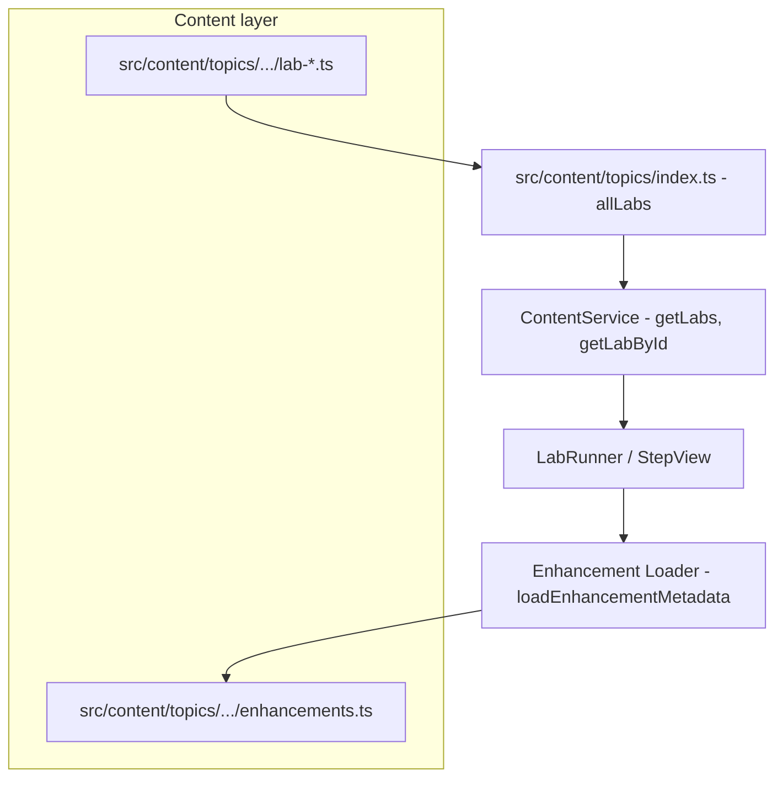

# Architecture and Adding Labs

This document describes the workshop framework architecture and the exact steps to add a new lab.

---

## Diagram A – High-level architecture

```
┌─────────────────────────────────────────────────────────────────────────────┐
│  CONTENT LAYER                                                               │
│  src/content/topics/                                                         │
│  ├── <topic>/ (e.g. operations, encryption, query)                           │
│  │   ├── topic.ts                                                            │
│  │   └── <pov>/ (e.g. full-recovery-rpo, csfle)                              │
│  │       ├── lab-*.ts          ← Lab definitions (steps use enhancementId)  │
│  │       └── enhancements.ts   ← Code blocks, tips per enhancementId         │
└─────────────────────────────────────────────────────────────────────────────┘
                                        │
                                        ▼
┌─────────────────────────────────────────────────────────────────────────────┐
│  REGISTRY                                                                    │
│  src/content/topics/index.ts                                                 │
│  - Exports allTopics, allLabs                                                │
│  - Imports every lab from topic/<pov>/lab-*.ts                               │
│  - allLabs = [ ... ]                                                         │
└─────────────────────────────────────────────────────────────────────────────┘
                                        │
                                        ▼
┌─────────────────────────────────────────────────────────────────────────────┐
│  CONTENT SERVICE                                                             │
│  src/services/contentService.ts                                               │
│  - Imports allLabs, allTopics from content/topics                            │
│  - getLabs(), getLabById(id), getTopics(), getLabsByTopic(), etc.            │
└─────────────────────────────────────────────────────────────────────────────┘
                                        │
                    ┌───────────────────┴───────────────────┐
                    ▼                                       ▼
┌──────────────────────────────┐    ┌─────────────────────────────────────────┐
│  LAB RUNTIME (UI)             │    │  ENHANCEMENT LOADER                      │
│  LabRunner / StepView         │    │  src/labs/enhancements/loader.ts         │
│  - Gets lab from              │───▶│  - moduleMap: prefix → import(           │
│    contentService             │    │      @/content/topics/.../enhancements) │
│  - For each step, resolves    │    │  - loadEnhancementMetadata(enhancementId) │
│    enhancementId via loader   │    │  - Returns codeBlocks, tips for step      │
└──────────────────────────────┘    └─────────────────────────────────────────┘
```

**Mermaid version (for renderers that support it):**



---

## Diagram B – Adding a lab (flow)

```
1. Create lab file
   └─▶ src/content/topics/<topic>/<pov>/lab-<name>.ts
       - Steps use enhancementId (e.g. 'my-pov.concepts')
       - No inline codeBlocks in steps

2. Create or update enhancements
   └─▶ src/content/topics/<topic>/<pov>/enhancements.ts
       - One entry per enhancementId used in the lab
       - id, povCapability, sourceProof, sourceSection, codeBlocks, tips

3. Register lab
   └─▶ src/content/topics/index.ts
       - Add: import { labXxxDefinition } from './<topic>/<pov>/lab-xxx';
       - Add: labXxxDefinition to the allLabs array

4. Register loader (only if POV prefix is new)
   └─▶ src/labs/enhancements/loader.ts
       - Add to moduleMap: 'my-pov': () => import('@/content/topics/<topic>/<pov>/enhancements')
       - Add 'my-pov' to preloadAllEnhancements prefixes array

5. Validate and test
   └─▶ node scripts/validate-content.js
   └─▶ Run app, open new lab, confirm steps load
```

---

## Checklist – What’s necessary to add a lab

- [ ] **Lab definition file** – `src/content/topics/<topic>/<pov>/lab-<slug>.ts` with steps that use **enhancementId** (no inline codeBlocks in the current pattern).
- [ ] **Enhancements file** – Same folder: `enhancements.ts` with one entry per enhancementId (id, povCapability, sourceProof, sourceSection, codeBlocks, tips).
- [ ] **Index registration** – In `src/content/topics/index.ts`: add the import and add the lab’s export to the **allLabs** array.
- [ ] **Loader registration** – If the POV prefix is new: in `src/labs/enhancements/loader.ts`, add the prefix to **moduleMap** and to the **preloadAllEnhancements** prefixes array.
- [ ] **Enhancement tests** – Add `src/test/labs/<PovPascal>Enhancements.test.ts` (e.g. `PartialRecoveryRpoEnhancements.test.ts`) using `getStepEnhancement` from `@/labs/stepEnhancementRegistry`. One test per enhancementId; run `npx vitest run src/test/labs/<PovPascal>Enhancements.test.ts` and fix until they pass.
- [ ] **Validate** – Run `node scripts/validate-content.js` and fix any errors.
- [ ] **Smoke test** – Open the app, select the new lab, and confirm steps show enhancement content (code blocks, tips).

---

## Related docs

- **Adding a lab with one prompt:** [ADD_LAB_MASTER_PROMPT.md](./ADD_LAB_MASTER_PROMPT.md)
- **Content creator workflow:** [CONTENT_CREATOR_QUICK_START.md](./CONTENT_CREATOR_QUICK_START.md)
- **Folder structure:** [LAB_FOLDER_STRUCTURE_GUIDELINE.md](./LAB_FOLDER_STRUCTURE_GUIDELINE.md)
