# MongoDB CSFLE & Queryable Encryption Workshop
## Complete Self-Paced Learning Guide

> **For Solutions Architects & Security Engineers**  
> Estimated Time: ~1.5 hours (45 min presentation + 45 min labs) | Difficulty: Intermediate to Advanced

---

## Table of Contents

1. [Introduction & Learning Objectives](#1-introduction--learning-objectives)
2. [Prerequisites](#2-prerequisites)
3. [The Challenge: Why In-Use Encryption?](#3-the-challenge-why-in-use-encryption)
4. [Use Cases by Industry](#4-use-cases-by-industry)
5. [Architecture Deep Dive](#5-architecture-deep-dive)
6. [CSFLE vs Queryable Encryption](#6-csfle-vs-queryable-encryption)
7. [Key Management](#7-key-management)
8. [Competitive Positioning](#8-competitive-positioning)
9. [Discovery Questions & Objection Handling](#9-discovery-questions--objection-handling)
10. [Lab 1: CSFLE Fundamentals with AWS KMS](#10-lab-1-csfle-fundamentals-with-aws-kms)
11. [Lab 2: Queryable Encryption & Range Queries](#11-lab-2-queryable-encryption--range-queries)
12. [Lab 3: Migration & Multi-Tenant Patterns](#12-lab-3-migration--multi-tenant-patterns)
13. [SA Quick Reference Cheat Sheet](#13-sa-quick-reference-cheat-sheet)
14. [Troubleshooting FAQ](#14-troubleshooting-faq)
15. [Additional Resources](#15-additional-resources)

---

## 1. Introduction & Learning Objectives

This workshop provides comprehensive training on MongoDB's **Client-Side Field Level Encryption (CSFLE)** and **Queryable Encryption (QE)** technologies. These features enable true zero-trust data protection where sensitive data is encrypted **before** it ever reaches the database.

### What You'll Learn

By the end of this workshop, you will be able to:

- ✅ Explain the business value of in-use encryption vs. traditional TDE
- ✅ Implement CSFLE with AWS KMS integration
- ✅ Configure Queryable Encryption with Range queries
- ✅ Apply the "Right to Erasure" pattern for GDPR compliance
- ✅ Position MongoDB encryption against competitors (Oracle, PostgreSQL, Cosmos DB)
- ✅ Handle common customer objections with data-driven responses

### Workshop Structure

| Section | Duration | Type |
|---------|----------|------|
| Presentation (Slides 1-21) | 45 min | Conceptual |
| Lab 1: CSFLE Fundamentals with AWS KMS | 15 min | Hands-on |
| Lab 2: Queryable Encryption & Range Queries | 15 min | Hands-on |
| Lab 3: Migration & Multi-Tenant Patterns | 15 min | Hands-on |
| **Total Hands-On Time** | **45 min** | **45 minutes** |
| **Total Workshop Time** | **90 min** | **~1.5 hours** |

---

## 2. Prerequisites

### Required Access

- **MongoDB Atlas** M10+ cluster (or local MongoDB 7.0+ Enterprise)
- **AWS Account** with KMS access (or Azure Key Vault / GCP KMS)
- **Node.js 18+** and npm installed
- **MongoDB Compass** for visual inspection

### AWS KMS Setup

Before starting the labs, ensure you have:

1. Created a **Customer Master Key (CMK)** in AWS KMS
2. An **IAM User** with the following permissions:
   - `kms:Encrypt`
   - `kms:Decrypt`
   - `kms:DescribeKey`
   - `kms:GenerateDataKey`

### Environment Variables

Set these before running any lab code:

```bash
export MONGODB_URI="mongodb+srv://<user>:<pass>@cluster.mongodb.net/"
export AWS_ACCESS_KEY_ID="your_access_key"
export AWS_SECRET_ACCESS_KEY="your_secret_key"
export AWS_KEY_ARN="arn:aws:kms:us-east-1:123456789012:key/your-key-uuid"
export AWS_KEY_REGION="us-east-1"
```

---

## 3. The Challenge: Why In-Use Encryption?

### The Data Breach Reality

| Metric | Value | Source |
|--------|-------|--------|
| Average breach cost | **$4.88 million** | IBM 2024 |
| Average detection time | **277 days** | IBM 2024 |
| Breaches involving insiders | **34%** | Verizon DBIR |

### The Encryption Gap

Most organizations encrypt data **at rest** (TDE) and **in transit** (TLS), but this leaves a critical gap:


**The Problem**: With TDE, data is decrypted in memory. Database administrators, cloud operators, and anyone with backup access can see plaintext sensitive data.

### Customer Trigger Phrases

Listen for these in customer conversations:

- *"We can't move to the cloud because of data residency concerns"*
- *"Our DBAs shouldn't have access to customer PII"*
- *"We need separation of duties for compliance"*
- *"We're worried about insider threats"*
- *"Our security team won't approve cloud migration"*

### The MongoDB Solution

```mermaid
graph LR
    A[Application + Keys<br/>✅ ENCRYPTED<br/>Only app sees plaintext] -->|Ciphertext| B[Database<br/>✅ ENCRYPTED<br/>Never decrypted]
    B -->|Ciphertext| C[Disk<br/>✅ ENCRYPTED]
    
    style A fill:#c8e6c9
    style B fill:#c8e6c9
    style C fill:#c8e6c9
```



**Key Insight**: MongoDB **never** sees plaintext. Not in memory, not in logs, not in backups. True zero-trust.

---

## 4. Use Cases by Industry

### Healthcare (HIPAA)

**Protected Data**: PHI (Patient Health Information), SSNs, Medical Record Numbers

```javascript
// Example: Encrypting patient data
{
  patientId: "P-12345",
  name: "Jane Doe",
  ssn: Binary("encrypted..."),           // CSFLE Deterministic
  diagnosis: Binary("encrypted..."),     // CSFLE Random
  labResults: Binary("encrypted...")     // QE for range queries
}
```

**Compliance Benefit**: Even if a backup tape is stolen, PHI remains encrypted.

### Financial Services (PCI-DSS)

**Protected Data**: Account numbers, transaction amounts, credit scores

```javascript
// Example: Encrypting financial data
{
  accountId: "ACC-98765",
  accountNumber: Binary("encrypted..."),  // CSFLE Deterministic (lookup)
  balance: Binary("encrypted..."),        // QE Range (for thresholds)
  creditScore: Binary("encrypted...")     // QE Range (for eligibility)
}
```

**Compliance Benefit**: Auditors can verify encryption without accessing plaintext.

### Gaming & Gambling (Regulatory)

**Protected Data**: Player identities, transaction histories, age verification

**Compliance Benefit**: Separation of duties between operations and player data.

### Common Thread: Separation of Duties

In all industries, the key value proposition is:

> **"Your DBAs, cloud admins, and backup operators cannot see sensitive customer data—even with full database access."**

---

## 5. Architecture Deep Dive

### Core Principle

Data is encrypted **client-side** (in your application) before being sent to MongoDB. The database only ever stores and processes ciphertext.

### Architecture Diagram

```mermaid
flowchart TD
    subgraph APP["🖥️ APPLICATION LAYER"]
        A1[Application Code]
        A2[MongoDB Driver<br/>Auto-Encrypt]
        A3[libmongocrypt]
        A1 --> A2 --> A3
    end
    
    subgraph KMS["🔐 KMS PROVIDER"]
        K1[CMK<br/>Customer Master Key<br/>━━━━━━━━━━━━━━━━━━━━━━━━━━━━<br/>• AWS KMS / Azure / GCP<br/>• Wraps/unwraps DEKs<br/>• Never leaves KMS]
    end
    
    subgraph MONGO["🗄️ MONGODB ATLAS"]
        M1[encryption.__keyVault<br/>━━━━━━━━━━━━━━━━━━━━━━━━━━━━<br/>Wrapped DEKs<br/>Encrypted by CMK]
        M2[Your Collections<br/>━━━━━━━━━━━━━━━━━━━━━━━━━━━━<br/>Ciphertext Data<br/>Never decrypted]
    end
    
    A3 <-->|Unwrap DEK| K1
    K1 -->|Store Wrapped DEK| M1
    A3 -->|Encrypted Data| M2
    
    style APP fill:#e3f2fd,stroke:#1976d2,stroke-width:3px
    style KMS fill:#fff3e0,stroke:#f57c00,stroke-width:3px
    style MONGO fill:#f3e5f5,stroke:#7b1fa2,stroke-width:3px
    style A1 fill:#bbdefb
    style A2 fill:#90caf9
    style A3 fill:#64b5f6
    style K1 fill:#ffe0b2,stroke:#f57c00,stroke-width:2px
    style M1 fill:#e1bee7
    style M2 fill:#ce93d8
```



**Data Flow**:
1. Application requests DEK unwrapping from KMS
2. KMS unwraps DEK using CMK (returns to application in memory)
3. Application encrypts data using unwrapped DEK
4. MongoDB stores encrypted data and wrapped DEKs

**Security Guarantees**:
- ⛔ MongoDB NEVER sees plaintext
- ⛔ DBAs cannot decrypt without KMS access
- ⛔ Backups contain only ciphertext
- ✅ Encryption happens client-side before data reaches MongoDB

### Who Sees What?

| Role | Can See Plaintext? | Why? |
|------|-------------------|------|
| Application | ✅ Yes | Has KMS credentials |
| MongoDB Atlas | ❌ No | Never has key access |
| DBA | ❌ No | No KMS credentials |
| Cloud Admin | ❌ No | No KMS credentials |
| Backup System | ❌ No | Stores ciphertext only |
| Attacker (DB breach) | ❌ No | Would need KMS access |

### Implementation Modes

#### Automatic Encryption (Recommended)

The driver automatically encrypts/decrypts based on a schema map. Application code is unchanged.

```javascript
// Schema Map defines what to encrypt
const schemaMap = {
  "hr.employees": {
    bsonType: "object",
    properties: {
      ssn: {
        encrypt: {
          keyId: [dekId],
          bsonType: "string",
          algorithm: "AEAD_AES_256_CBC_HMAC_SHA_512-Deterministic"
        }
      }
    }
  }
};

// Client auto-encrypts transparently
const client = new MongoClient(uri, {
  autoEncryption: { schemaMap, kmsProviders, keyVaultNamespace }
});

// Normal insert - driver encrypts automatically
await client.db("hr").collection("employees").insertOne({
  name: "Alice",
  ssn: "123-45-6789"  // Encrypted before leaving application
});
```

#### Explicit Encryption (Fine-grained Control)

You manually call encrypt/decrypt. Useful for migrations and complex scenarios.

```javascript
const encrypted = await clientEncryption.encrypt(
  "123-45-6789",
  { keyId: dekId, algorithm: "AEAD_AES_256_CBC_HMAC_SHA_512-Deterministic" }
);

await collection.insertOne({ ssn: encrypted });
```

---

## 6. CSFLE vs Queryable Encryption

### Decision Matrix

| Requirement | Recommendation | Why? |
|-------------|----------------|------|
| Range queries ($gt, $lt) | **Queryable Encryption** | Only QE supports range on ciphertext |
| MongoDB < 8.0 | **CSFLE** | QE Range requires 8.0+ GA |
| Maximum security | **Queryable Encryption** | Randomized encryption prevents frequency analysis |
| Minimum storage | **CSFLE** | QE indexes add 2-3x storage overhead |
| New 8.0+ deployment | **Queryable Encryption** | Future-proof, most capable |

### Query Support Matrix

| Query Type | CSFLE Deterministic | CSFLE Random | Queryable Encryption |
|------------|:-------------------:|:------------:|:--------------------:|
| **Equality ($eq)** | ✅ | ❌ | ✅ |
| **Range ($gt, $lt, $gte, $lte)** | ❌ | ❌ | ✅ |
| **Prefix Match** | ❌ | ❌ | ✅ |
| **Suffix Match** | ❌ | ❌ | ✅ |
| **$in** | ✅ | ❌ | ✅ |
| **Regex / $text** | ❌ | ❌ | ❌ |
| **Sorting** | ❌ | ❌ | ❌ |
| **Aggregation ($sum, $avg)** | ❌ | ❌ | ❌ |

### Algorithm Comparison

#### CSFLE: Deterministic
- Same plaintext → Same ciphertext
- Enables equality queries
- ⚠️ Leaks frequency patterns (how often values repeat)

#### CSFLE: Randomized
- Same plaintext → Different ciphertext each time
- Maximum security
- ❌ Cannot query

#### Queryable Encryption
- Randomized ciphertext + special tokens for searching
- Supports equality AND range queries
- Tokens stored in metadata collections (.esc, .ecoc)

### Key Difference: DEK Mapping

| Feature | CSFLE | Queryable Encryption |
|---------|-------|---------------------|
| DEK per collection | ✅ Allowed | ❌ Not allowed |
| DEK per field | ✅ Allowed | ✅ **Required** |
| Shared DEK across fields | ✅ Allowed | ❌ Not allowed |

> **Critical**: In QE, each encrypted field MUST have its own unique DEK. This is because the metadata in `.esc` collections is bound to specific fields.

---

## 7. Key Management

### Envelope Encryption

MongoDB uses a two-tier key hierarchy:

```mermaid
graph TD
    A[CMK<br/>Customer Master Key<br/>━━━━━━━━━━━━━━━━<br/>Location: Your KMS<br/>AWS / Azure / GCP<br/>Purpose: Wraps/unwraps DEKs<br/>Rotation: Annual transparent] -->|Wraps| B[DEK<br/>Data Encryption Key<br/>━━━━━━━━━━━━━━━━<br/>Location: encryption.__keyVault<br/>Purpose: Encrypts actual data<br/>Stored: Encrypted by CMK]
    B -->|Encrypts| C[Your Sensitive Data<br/>━━━━━━━━━━━━━━━━<br/>SSN, salary,<br/>medical records, etc.]
    
    style A fill:#ffccbc,stroke:#ff5722,stroke-width:3px
    style B fill:#c5e1a5,stroke:#689f38,stroke-width:2px
    style C fill:#b3e5fc,stroke:#0288d1,stroke-width:2px
```



### Supported KMS Providers

| Provider | Configuration Key | Common Use Case |
|----------|------------------|-----------------|
| AWS KMS | `aws` | Most common, enterprise standard |
| Azure Key Vault | `azure` | Microsoft-centric shops |
| Google Cloud KMS | `gcp` | GCP deployments |
| KMIP | `kmip` | On-premises HSMs |
| Local Key | `local` | **Development only** |

### Key Rotation Strategy

#### CMK Rotation (Annual)

Use `rewrapManyDataKey()` to re-encrypt DEKs with a new CMK. **No data rewrite required**.

```javascript
await clientEncryption.rewrapManyDataKey(
  { },  // Filter: all keys, or specific keyAltNames
  {
    provider: "aws",
    masterKey: { 
      key: "arn:aws:kms:us-east-1:123456789012:key/NEW-KEY-UUID",
      region: "us-east-1"
    }
  }
);
```

**What happens**:
1. Each DEK is decrypted using the old CMK
2. DEK is re-encrypted with the new CMK
3. DEK document updated in `__keyVault`
4. Actual data remains untouched

#### Best Practice: keyAltNames

Instead of hardcoding DEK UUIDs, use human-readable aliases:

```javascript
// Create DEK with alias
await clientEncryption.createDataKey("aws", {
  masterKey: { key: cmkArn, region: "us-east-1" },
  keyAltNames: ["hr-employees-ssn"]
});

// Reference by alias in schema
const schemaMap = {
  "hr.employees": {
    properties: {
      ssn: {
        encrypt: {
          keyAltName: "hr-employees-ssn",  // Not UUID!
          algorithm: "..."
        }
      }
    }
  }
};
```

---

## 8. Competitive Positioning

### vs. Oracle TDE / Microsoft SQL Server TDE

**Customer Objection**: *"We already have TDE. Isn't that enough?"*

**Response**:

> "TDE decrypts data in memory for query processing. This means your DBAs, cloud administrators, and anyone with backup access can see plaintext customer data. With MongoDB's Client-Side Field Level Encryption, data is encrypted **before** it leaves your application. MongoDB never sees plaintext—not in memory, not in logs, not in backups. It's the difference between locking the door vs. making yourself invisible."

| Aspect | Oracle/SQL Server TDE | MongoDB CSFLE/QE |
|--------|----------------------|------------------|
| Encryption location | Database server | Application (client) |
| DBA sees plaintext? | ✅ Yes | ❌ No |
| Cloud admin sees plaintext? | ✅ Yes | ❌ No |
| Backups contain plaintext? | ✅ Yes (in restored state) | ❌ No |
| Key management | Database-controlled | Customer-controlled KMS |

### vs. PostgreSQL

**Customer Objection**: *"PostgreSQL has pgcrypto for encryption."*

**Response**:

> "PostgreSQL can encrypt data with pgcrypto, but it cannot **search** encrypted data without decrypting it first. Every query requires full decryption, defeating the purpose of encryption for analytics or range queries. MongoDB's Queryable Encryption lets you run equality and range queries directly on ciphertext—the server never sees plaintext."

### vs. Azure Cosmos DB

**Customer Objection**: *"Cosmos DB has Always Encrypted."*

**Response**:

> "Cosmos DB's Always Encrypted is still in preview for most features, supports only deterministic encryption (vulnerable to frequency analysis), and has limited data type support. MongoDB's Queryable Encryption is GA, supports randomized encryption with range queries, and has been battle-tested in production for years."

### The 30-Second Elevator Pitch

> "Field-Level Encryption is the ultimate insurance policy against the $4.88 million average breach cost. Even if an attacker gets full database access, they get useless ciphertext. Even if a backup tape is stolen, the data is protected. Even if a malicious insider has DBA privileges, they cannot see sensitive customer data. And with Queryable Encryption in MongoDB 8.0, you can run range queries on encrypted data—something no competitor can match."

---

## 9. Discovery Questions & Objection Handling

### Discovery Questions to Ask

Use these to qualify opportunities and uncover encryption needs:

1. **"Who currently has access to view sensitive customer data in your database?"**
   - Target: Expose that DBAs, cloud admins, backup operators can see PII

2. **"Is it acceptable for your DBAs to see customer SSNs or credit card numbers?"**
   - Target: Plant the zero-trust seed

3. **"What's blocking your cloud migration today?"**
   - Target: Often security/privacy concerns (unblocker!)

4. **"How do you handle GDPR Right to Erasure requests today?"**
   - Target: Introduce crypto-shredding pattern

5. **"What's your latency budget for encrypted operations?"**
   - Target: Qualify early (expect 10-20% overhead)

6. **"Do you need to aggregate or sort on sensitive fields?"**
   - Target: Technical disqualifier for current encryption (honest limitation)

### Common Objections & Responses

#### "Encryption will kill our performance"

> "The overhead is typically 10-20% for encrypted fields, not the entire workload. Most customers encrypt 3-5 sensitive fields out of dozens. We recommend benchmarking with your actual workload, but in our experience, the security benefits far outweigh the modest performance cost."

#### "We already encrypt at rest with TDE"

> "TDE protects against physical disk theft, but the data is fully decrypted in memory for query processing. Any DBA, cloud admin, or backup operator can see plaintext. With Client-Side Encryption, even MongoDB itself cannot see your data."

#### "Our compliance auditor is satisfied with TDE"

> "Compliance requirements are evolving. GDPR, CCPA, and PCI-DSS 4.0 increasingly emphasize separation of duties and minimizing data exposure. Client-Side Encryption demonstrates a proactive security posture that goes beyond minimum compliance."

#### "This seems too complex to implement"

> "With Automatic Encryption, you define a schema map once, and the driver handles all crypto transparently. Your application code doesn't change—inserts and queries work normally. We have customers running in production with just a few days of integration work."

---

## 10. Lab 1: CSFLE Fundamentals with AWS KMS

**Duration**: 15 minutes  
**Objective**: Implement Client-Side Field Level Encryption with AWS KMS

> **Lab Guide**: See `Docs/Enablement/Lab_1_CSFLE_AWS.md` for detailed step-by-step instructions.

### Prerequisites Checklist

- [ ] MongoDB Atlas M10+ cluster or local MongoDB 7.0+ Enterprise
- [ ] AWS account with KMS access
- [ ] Node.js 18+ installed
- [ ] `mongodb` and `mongodb-client-encryption` packages

### Step 1: Create Customer Master Key (CMK) in AWS KMS

**Duration**: 5 minutes

```bash
# Using AWS CLI
aws kms create-key \
  --description "MongoDB CSFLE CMK for Workshop" \
  --key-usage ENCRYPT_DECRYPT \
  --origin AWS_KMS \
  --region us-east-1
```

**Expected Output**:
```json
{
  "KeyMetadata": {
    "KeyId": "12345678-1234-1234-1234-123456789012",
    "Arn": "arn:aws:kms:us-east-1:123456789012:key/12345678-1234-1234-1234-123456789012",
    "KeyState": "Enabled"
  }
}
```

Save the `Arn` value—you'll need it throughout the labs.

### Step 2: Apply KMS Key Policy

**Duration**: 3 minutes

Create a key policy that allows your IAM user to use the CMK:

```bash
aws kms put-key-policy \
  --key-id YOUR_KEY_ID \
  --policy-name default \
  --policy '{
    "Version": "2012-10-17",
    "Statement": [
      {
        "Effect": "Allow",
        "Principal": { "AWS": "arn:aws:iam::123456789012:user/your-user" },
        "Action": [
          "kms:Encrypt",
          "kms:Decrypt",
          "kms:DescribeKey",
          "kms:GenerateDataKey"
        ],
        "Resource": "*"
      }
    ]
  }'
```

### Step 3: Initialize Key Vault with Unique Index

**Duration**: 5 minutes

The `__keyVault` collection MUST have a unique index on `keyAltNames`:

```javascript
// init-keyvault.js
const { MongoClient } = require('mongodb');

async function initKeyVault() {
  const client = new MongoClient(process.env.MONGODB_URI);
  await client.connect();
  
  const keyVault = client.db("encryption").collection("__keyVault");
  
  // Create unique index on keyAltNames
  await keyVault.createIndex(
    { keyAltNames: 1 },
    { 
      unique: true, 
      partialFilterExpression: { keyAltNames: { $exists: true } }
    }
  );
  
  console.log("✅ Key vault initialized with unique index");
  await client.close();
}

initKeyVault();
```

**Run**:
```bash
node init-keyvault.js
```

### Step 4: Generate Data Encryption Keys (DEKs)

**Duration**: 10 minutes

```javascript
// create-deks.js
const { MongoClient } = require('mongodb');
const { ClientEncryption } = require('mongodb-client-encryption');

async function createDEKs() {
  const client = new MongoClient(process.env.MONGODB_URI);
  await client.connect();
  
  const kmsProviders = {
    aws: {
      accessKeyId: process.env.AWS_ACCESS_KEY_ID,
      secretAccessKey: process.env.AWS_SECRET_ACCESS_KEY
    }
  };
  
  const encryption = new ClientEncryption(client, {
    keyVaultNamespace: "encryption.__keyVault",
    kmsProviders
  });
  
  const masterKey = {
    key: process.env.AWS_KEY_ARN,
    region: process.env.AWS_KEY_REGION
  };
  
  // Create DEK for SSN field
  const ssnDekId = await encryption.createDataKey("aws", {
    masterKey,
    keyAltNames: ["hr-employees-ssn"]
  });
  console.log("✅ SSN DEK created:", ssnDekId.toString('hex'));
  
  // Create DEK for salary field
  const salaryDekId = await encryption.createDataKey("aws", {
    masterKey,
    keyAltNames: ["hr-employees-salary"]
  });
  console.log("✅ Salary DEK created:", salaryDekId.toString('hex'));
  
  await client.close();
}

createDEKs();
```

**Run**:
```bash
node create-deks.js
```

### Step 5: Verify DEK Creation

**Duration**: 5 minutes

Open MongoDB Compass and navigate to `encryption.__keyVault`. You should see:

```json
{
  "_id": UUID("..."),
  "keyMaterial": Binary("..."),  // Encrypted DEK
  "creationDate": ISODate("..."),
  "keyAltNames": ["hr-employees-ssn"],
  "masterKey": {
    "provider": "aws",
    "key": "arn:aws:kms:...",
    "region": "us-east-1"
  }
}
```

**Checkpoint**: Confirm you see two documents with your `keyAltNames`.

### Step 6: Test CSFLE with Insert & Query

**Duration**: 15 minutes

```javascript
// test-csfle.js
const { MongoClient } = require('mongodb');

async function testCSFLE() {
  const kmsProviders = {
    aws: {
      accessKeyId: process.env.AWS_ACCESS_KEY_ID,
      secretAccessKey: process.env.AWS_SECRET_ACCESS_KEY
    }
  };
  
  // Schema map for automatic encryption
  const schemaMap = {
    "hr.employees": {
      bsonType: "object",
      encryptMetadata: {
        keyId: "/keyAltName"  // Dynamic lookup
      },
      properties: {
        ssn: {
          encrypt: {
            keyAltName: "hr-employees-ssn",
            bsonType: "string",
            algorithm: "AEAD_AES_256_CBC_HMAC_SHA_512-Deterministic"
          }
        },
        salary: {
          encrypt: {
            keyAltName: "hr-employees-salary",
            bsonType: "int",
            algorithm: "AEAD_AES_256_CBC_HMAC_SHA_512-Random"
          }
        }
      }
    }
  };
  
  // Create encrypted client
  const secureClient = new MongoClient(process.env.MONGODB_URI, {
    autoEncryption: {
      keyVaultNamespace: "encryption.__keyVault",
      kmsProviders,
      schemaMap
    }
  });
  
  await secureClient.connect();
  const employees = secureClient.db("hr").collection("employees");
  
  // Insert encrypted document
  await employees.insertOne({
    name: "Alice Johnson",
    department: "Engineering",
    ssn: "123-45-6789",     // Encrypted automatically
    salary: 95000           // Encrypted automatically
  });
  console.log("✅ Document inserted with encrypted fields");
  
  // Query by encrypted field (deterministic only!)
  const found = await employees.findOne({ ssn: "123-45-6789" });
  console.log("✅ Found:", found.name, "SSN:", found.ssn);
  
  await secureClient.close();
}

testCSFLE();
```

**Run**:
```bash
node test-csfle.js
```

### Step 7: Verify Encryption in Compass

**Duration**: 7 minutes

1. Open MongoDB Compass
2. Navigate to `hr.employees`
3. Observe the document:
   - `name` and `department`: Plaintext
   - `ssn`: Binary (Subtype 6)
   - `salary`: Binary (Subtype 6)

**Screenshot what you see**: The binary representation proves the data is encrypted at rest.

### Step 8: Test with Non-Encrypted Client

**Duration**: 5 minutes

```javascript
// test-unencrypted.js
const { MongoClient } = require('mongodb');

async function testUnencrypted() {
  // Regular client without encryption
  const client = new MongoClient(process.env.MONGODB_URI);
  await client.connect();
  
  const employees = client.db("hr").collection("employees");
  const doc = await employees.findOne({ name: "Alice Johnson" });
  
  console.log("Name:", doc.name);
  console.log("SSN (encrypted):", doc.ssn);  // Binary blob
  console.log("Salary (encrypted):", doc.salary);  // Binary blob
  
  await client.close();
}

testUnencrypted();
```

**Expected Output**: SSN and salary show as Binary objects—not readable.

### Lab 1 Troubleshooting

| Error | Solution |
|-------|----------|
| `KMS Error: AccessDenied` | Check IAM permissions for `kms:Decrypt` |
| `Namespace not found` | Ensure `keyVaultNamespace` matches exactly |
| `Cannot find shared library` | Set `cryptSharedLibPath` in `extraOptions` |
| `Duplicate key error` | The `__keyVault` unique index is working—use `keyAltNames` |

---

## 11. Lab 2: Queryable Encryption & Range Queries

**Duration**: 15 minutes  
**Objective**: Implement Queryable Encryption with range queries on encrypted numeric data

> **Lab Guide**: See `Docs/Enablement/Lab_2_QE_AWS.md` for detailed step-by-step instructions.

### Prerequisites

- Completed Lab 1
- MongoDB 8.0+ cluster
- Same AWS KMS setup

### Step 1: Create DEKs for QE

**Duration**: 7 minutes

QE requires **separate DEKs for each encrypted field**:

```javascript
// create-qe-deks.js
const { MongoClient } = require('mongodb');
const { ClientEncryption } = require('mongodb-client-encryption');

async function createQEDEKs() {
  const client = new MongoClient(process.env.MONGODB_URI);
  await client.connect();
  
  const kmsProviders = {
    aws: {
      accessKeyId: process.env.AWS_ACCESS_KEY_ID,
      secretAccessKey: process.env.AWS_SECRET_ACCESS_KEY
    }
  };
  
  const encryption = new ClientEncryption(client, {
    keyVaultNamespace: "encryption.__keyVault",
    kmsProviders
  });
  
  const masterKey = {
    key: process.env.AWS_KEY_ARN,
    region: process.env.AWS_KEY_REGION
  };
  
  // DEK for salary (range queries)
  const salaryDek = await encryption.createDataKey("aws", {
    masterKey,
    keyAltNames: ["qe-salary-key"]
  });
  console.log("✅ Salary DEK:", salaryDek.toString('hex'));
  
  // DEK for taxId (equality queries)
  const taxIdDek = await encryption.createDataKey("aws", {
    masterKey,
    keyAltNames: ["qe-taxid-key"]
  });
  console.log("✅ TaxID DEK:", taxIdDek.toString('hex'));
  
  await client.close();
  
  return { salaryDek, taxIdDek };
}

createQEDEKs();
```

### Step 2: Create QE Collection with encryptedFields

**Duration**: 10 minutes

```javascript
// create-qe-collection.js
const { MongoClient } = require('mongodb');
const { ClientEncryption } = require('mongodb-client-encryption');

async function createQECollection() {
  const client = new MongoClient(process.env.MONGODB_URI);
  await client.connect();
  
  const kmsProviders = { /* same as before */ };
  
  const encryption = new ClientEncryption(client, {
    keyVaultNamespace: "encryption.__keyVault",
    kmsProviders
  });
  
  // Lookup DEK IDs by keyAltNames
  const keyVault = client.db("encryption").collection("__keyVault");
  const salaryKeyDoc = await keyVault.findOne({ keyAltNames: "qe-salary-key" });
  const taxIdKeyDoc = await keyVault.findOne({ keyAltNames: "qe-taxid-key" });
  
  // Define encryptedFields with Range support
  const encryptedFields = {
    fields: [
      {
        path: "salary",
        bsonType: "int",
        keyId: salaryKeyDoc._id,
        queries: {
          queryType: "range",
          min: 0,
          max: 500000,
          sparsity: 2,
          contention: 4
        }
      },
      {
        path: "taxId",
        bsonType: "string",
        keyId: taxIdKeyDoc._id,
        queries: { queryType: "equality" }
      }
    ]
  };
  
  // Create collection with QE schema
  const db = client.db("hr");
  await db.createCollection("employees_qe", { encryptedFields });
  console.log("✅ QE collection created");
  
  await client.close();
}

createQECollection();
```

**Parameter Reference**:

| Parameter | Purpose | Recommended Value |
|-----------|---------|-------------------|
| `min` / `max` | Bounds for range tokens | Set to realistic data bounds |
| `sparsity` | Reduces storage at cost of precision | 1-4 (higher = less storage) |
| `contention` | Security vs. write performance | 0-16 (higher = more secure) |

### Step 3: Insert Test Data

**Duration**: 8 minutes

```javascript
// insert-qe-data.js
const { MongoClient } = require('mongodb');

async function insertQEData() {
  const kmsProviders = { /* same as before */ };
  
  const secureClient = new MongoClient(process.env.MONGODB_URI, {
    autoEncryption: {
      keyVaultNamespace: "encryption.__keyVault",
      kmsProviders
    }
  });
  
  await secureClient.connect();
  const employees = secureClient.db("hr").collection("employees_qe");
  
  // Insert sample employees
  await employees.insertMany([
    { name: "Alice", department: "Engineering", salary: 95000, taxId: "111-22-3333" },
    { name: "Bob", department: "Sales", salary: 75000, taxId: "444-55-6666" },
    { name: "Charlie", department: "Engineering", salary: 120000, taxId: "777-88-9999" },
    { name: "Diana", department: "HR", salary: 65000, taxId: "000-11-2222" }
  ]);
  
  console.log("✅ 4 employees inserted with encrypted salary and taxId");
  await secureClient.close();
}

insertQEData();
```

### Step 4: Execute Range Queries

**Duration**: 10 minutes

```javascript
// query-qe-range.js
const { MongoClient } = require('mongodb');

async function queryQERange() {
  const kmsProviders = { /* same as before */ };
  
  const secureClient = new MongoClient(process.env.MONGODB_URI, {
    autoEncryption: {
      keyVaultNamespace: "encryption.__keyVault",
      kmsProviders
    }
  });
  
  await secureClient.connect();
  const employees = secureClient.db("hr").collection("employees_qe");
  
  // Range query on encrypted salary!
  console.log("\n📊 Employees with salary between $70,000 and $100,000:");
  const rangeResults = await employees.find({
    salary: { $gte: 70000, $lte: 100000 }
  }).toArray();
  rangeResults.forEach(e => console.log(`  - ${e.name}: $${e.salary}`));
  
  // Equality query on encrypted taxId
  console.log("\n🔍 Looking up taxId 444-55-6666:");
  const equalityResult = await employees.findOne({ taxId: "444-55-6666" });
  console.log(`  Found: ${equalityResult.name}`);
  
  await secureClient.close();
}

queryQERange();
```

**Expected Output**:
```
📊 Employees with salary between $70,000 and $100,000:
  - Alice: $95000
  - Bob: $75000

🔍 Looking up taxId 444-55-6666:
  Found: Bob
```

### Step 5: Inspect Internal Collections

**Duration**: 10 minutes

Open MongoDB Compass and examine the `hr` database. Note the automatically created collections:

| Collection | Purpose |
|------------|---------|
| `employees_qe` | Your data (with encrypted fields) |
| `enxcol_.employees_qe.esc` | Encrypted Search Catalog (tokens) |
| `enxcol_.employees_qe.ecoc` | Encrypted Compaction Collection |
| `enxcol_.employees_qe.ecc` | Encrypted Counter Collection |

**Exercise**: Insert 10 more documents and observe the document count in `.ecoc` increase.

### Step 6: Compact Metadata Collections

**Duration**: 7 minutes

Over time, the `.ecoc` collection grows. Schedule regular compaction:

```javascript
// compact-qe.js
async function compactQE() {
  const client = new MongoClient(process.env.MONGODB_URI);
  await client.connect();
  
  const result = await client.db("hr").command({
    compactStructuredEncryptionData: "employees_qe"
  });
  
  console.log("✅ Compaction complete:", result);
  await client.close();
}

compactQE();
```

**Production Tip**: Schedule this monthly during low-traffic periods.

### Lab 2 Summary

✅ Created separate DEKs for each QE field  
✅ Defined encryptedFields with range parameters  
✅ Executed range queries on encrypted salary  
✅ Inspected internal .esc, .ecoc, .ecc collections  
✅ Learned to compact metadata  

---

## 12. Lab 3: Migration & Multi-Tenant Patterns

**Duration**: 15 minutes  
**Difficulty**: Advanced  
**Objective**: Implement data migration and multi-tenant encryption patterns

In the **interactive webapp**, Lab 3 has **3 steps**: (1) Explicit encryption for migration, (2) Multi-tenant isolation, (3) CMK key rotation.

> **Lab Guide**: See `Docs/Enablement/Lab_3_Patterns.md` for detailed step-by-step instructions.

### Prerequisites

- Completed Labs 1 & 2
- Understanding of CSFLE and QE fundamentals

### Learning Objectives

- Migrate existing plaintext data to an encrypted state
- Implement per-tenant isolation using `keyAltNames`
- Manage key rotation for a single tenant without impacting others
- Understand metadata management for large-scale DEK deployments

---

### Part 1: Data Migration Pattern

**Duration**: 15 minutes

**Scenario**: You have existing plaintext data that needs to be migrated to an encrypted collection.

**Key Concepts**:
- Use explicit encryption API for bulk migration operations
- Progress tracking and error handling
- Validation after migration

---

### Part 2: Multi-Tenant Key Isolation

**Duration**: 15 minutes

**Scenario**: SaaS application where each tenant must have separate encryption keys for data isolation.

**Key Concepts**:
- Per-tenant DEK creation using `keyAltNames`
- Dynamic schema configuration per tenant
- Tenant data isolation verification

---

### Key Rotation Procedures

**CMK Rotation** (Low Impact):
- AWS KMS supports automatic annual rotation
- Use `rewrapManyDataKey()` for zero-downtime rotation
- No data re-encryption required

**DEK Rotation** (High Impact):
- Requires data re-encryption
- Plan for maintenance window
- Update schemaMap after rotation

---

### Lab 3 Summary

✅ **Migration** requires explicit encryption API for bulk operations  
✅ **Multi-tenant** uses `keyAltNames` for per-tenant key isolation  
✅ **CMK rotation** is transparent and handled by AWS KMS  
✅ **DEK rotation** requires data re-encryption (plan accordingly)

---

## 13. Advanced Pattern: Right to Erasure (GDPR)

**Note**: This pattern is covered in the main workshop content. For hands-on implementation, refer to the code examples in Section 12 above.

### The Crypto-Shredding Pattern

**GDPR Article 17** (Right to Erasure) requires that personal data be deleted upon request. With encryption, you can achieve this cryptographically:

```mermaid
graph LR
    A[1 User] -->|Assigned| B[1 Unique DEK]
    B -->|Encrypts| C[All User's PII<br/>Email, Address,<br/>Medical Records, etc.]
    B -.->|DELETE THE DEK| D[Data becomes<br/>mathematically<br/>indecipherable garbage]
    
    E[✅ Works across backups] 
    F[✅ Works across replicas]
    G[✅ Works across secondary indexes]
    H[✅ Instant compliance<br/>no data rewrite needed]
    
    style A fill:#e1f5ff
    style B fill:#fff4e1,stroke:#ff9800,stroke-width:3px
    style C fill:#f3e5f5
    style D fill:#ffcccc,stroke:#f44336,stroke-width:2px
    style E fill:#c8e6c9
    style F fill:#c8e6c9
    style G fill:#c8e6c9
    style H fill:#c8e6c9
```



### Step 1: User Signup with DEK Provisioning

**Duration**: 10 minutes

```javascript
// user-signup.js
const { MongoClient } = require('mongodb');
const { ClientEncryption } = require('mongodb-client-encryption');

async function signupUser(username, email, address) {
  const client = new MongoClient(process.env.MONGODB_URI);
  await client.connect();
  
  const kmsProviders = { /* AWS config */ };
  const encryption = new ClientEncryption(client, {
    keyVaultNamespace: "encryption.__keyVault",
    kmsProviders
  });
  
  // Create unique DEK for this user
  const userDekId = await encryption.createDataKey("aws", {
    masterKey: { key: process.env.AWS_KEY_ARN, region: process.env.AWS_KEY_REGION },
    keyAltNames: [`user-${username}-dek`]
  });
  console.log(`✅ Created DEK for user ${username}`);
  
  // Store user record with reference to their DEK
  const users = client.db("app").collection("users");
  await users.insertOne({
    username,
    dekId: userDekId,
    dekAltName: `user-${username}-dek`,
    status: "active",
    createdAt: new Date()
  });
  
  // Encrypt and store PII using user's DEK
  const encryptedEmail = await encryption.encrypt(email, {
    keyId: userDekId,
    algorithm: "AEAD_AES_256_CBC_HMAC_SHA_512-Random"
  });
  
  const encryptedAddress = await encryption.encrypt(address, {
    keyId: userDekId,
    algorithm: "AEAD_AES_256_CBC_HMAC_SHA_512-Random"
  });
  
  const profiles = client.db("app").collection("profiles");
  await profiles.insertOne({
    username,
    email: encryptedEmail,
    address: encryptedAddress
  });
  
  console.log(`✅ User ${username} profile created with encrypted PII`);
  await client.close();
}

// Example usage
signupUser("john_doe", "john@example.com", "123 Main Street, NYC");
```

### Step 2: Normal Data Access

**Duration**: 5 minutes

```javascript
// read-user-profile.js
async function readUserProfile(username) {
  const client = new MongoClient(process.env.MONGODB_URI);
  await client.connect();
  
  const kmsProviders = { /* AWS config */ };
  const encryption = new ClientEncryption(client, {
    keyVaultNamespace: "encryption.__keyVault",
    kmsProviders
  });
  
  // Get user's DEK reference
  const users = client.db("app").collection("users");
  const user = await users.findOne({ username });
  
  // Read encrypted profile
  const profiles = client.db("app").collection("profiles");
  const profile = await profiles.findOne({ username });
  
  // Decrypt using user's DEK
  const email = await encryption.decrypt(profile.email);
  const address = await encryption.decrypt(profile.address);
  
  console.log(`📧 Email: ${email}`);
  console.log(`🏠 Address: ${address}`);
  
  await client.close();
}

readUserProfile("john_doe");
```

### Step 3: GDPR Erasure Request (Crypto-Shredding)

**Duration**: 10 minutes

```javascript
// gdpr-erasure.js
async function executeGDPRErasure(username) {
  const client = new MongoClient(process.env.MONGODB_URI);
  await client.connect();
  
  // 1. Find user's DEK
  const users = client.db("app").collection("users");
  const user = await users.findOne({ username });
  
  if (!user) {
    console.log("❌ User not found");
    return;
  }
  
  console.log(`🔑 Found DEK for ${username}: ${user.dekId.toString('hex')}`);
  
  // 2. DELETE THE DEK (this is the magic!)
  const keyVault = client.db("encryption").collection("__keyVault");
  const deleteResult = await keyVault.deleteOne({ _id: user.dekId });
  
  console.log(`🗑️ DEK deleted: ${deleteResult.deletedCount === 1}`);
  
  // 3. Mark user as erased (optional - for audit trail)
  await users.updateOne(
    { username },
    { $set: { status: "erased", erasedAt: new Date() } }
  );
  
  console.log(`✅ GDPR erasure complete for ${username}`);
  console.log(`   All PII is now cryptographically indecipherable`);
  
  await client.close();
}

executeGDPRErasure("john_doe");
```

### Step 4: Verify Data is Indecipherable

**Duration**: 10 minutes

```javascript
// verify-erasure.js
async function verifyErasure(username) {
  const client = new MongoClient(process.env.MONGODB_URI);
  await client.connect();
  
  const kmsProviders = { /* AWS config */ };
  const encryption = new ClientEncryption(client, {
    keyVaultNamespace: "encryption.__keyVault",
    kmsProviders
  });
  
  // Profile still exists in database
  const profiles = client.db("app").collection("profiles");
  const profile = await profiles.findOne({ username });
  
  console.log(`📄 Profile document exists: ${!!profile}`);
  console.log(`📄 Encrypted email (binary): ${profile.email.toString('hex').substring(0, 40)}...`);
  
  // Attempt to decrypt
  try {
    const email = await encryption.decrypt(profile.email);
    console.log(`❌ FAIL: Data was decrypted: ${email}`);
  } catch (error) {
    console.log(`✅ SUCCESS: Decryption failed as expected`);
    console.log(`   Error: ${error.message}`);
    console.log(`   Data is now mathematically unrecoverable`);
  }
  
  await client.close();
}

verifyErasure("john_doe");
```

**Expected Output**:
```
📄 Profile document exists: true
📄 Encrypted email (binary): 0123456789abcdef...
✅ SUCCESS: Decryption failed as expected
   Error: Unable to find key with id or keyAltName
   Data is now mathematically unrecoverable
```

### Step 5: Multi-Tenant Key Isolation

**Duration**: 10 minutes

For SaaS applications, isolate each tenant's data with separate DEKs:

```javascript
// multi-tenant.js
async function createTenantClient(tenantId) {
  const kmsProviders = { /* AWS config */ };
  
  // Dynamic schema using tenant's keyAltName
  const schemaMap = {
    "saas.data": {
      bsonType: "object",
      properties: {
        sensitiveData: {
          encrypt: {
            keyAltName: `tenant-${tenantId}-dek`,
            bsonType: "string",
            algorithm: "AEAD_AES_256_CBC_HMAC_SHA_512-Deterministic"
          }
        }
      }
    }
  };
  
  return new MongoClient(process.env.MONGODB_URI, {
    autoEncryption: {
      keyVaultNamespace: "encryption.__keyVault",
      kmsProviders,
      schemaMap
    }
  });
}

// Each tenant gets isolated encryption
const tenantAClient = await createTenantClient("acme-corp");
const tenantBClient = await createTenantClient("globex-inc");

// Tenant A's data is encrypted with their DEK
// Tenant B cannot decrypt Tenant A's data (different DEK)
```

### Step 6: Key Rotation (CMK Rewrap)

**Duration**: 10 minutes

```javascript
// key-rotation.js
async function rotateCMK(tenantKeyAltName, newCmkArn) {
  const client = new MongoClient(process.env.MONGODB_URI);
  await client.connect();
  
  const kmsProviders = { /* AWS config */ };
  const encryption = new ClientEncryption(client, {
    keyVaultNamespace: "encryption.__keyVault",
    kmsProviders
  });
  
  // Rewrap DEK with new CMK
  const result = await encryption.rewrapManyDataKey(
    { keyAltNames: tenantKeyAltName },
    {
      provider: "aws",
      masterKey: { key: newCmkArn, region: process.env.AWS_KEY_REGION }
    }
  );
  
  console.log(`✅ Rewrapped ${result.bulkWriteResult.modifiedCount} keys`);
  console.log(`   No data was re-encrypted (only the DEK wrapper changed)`);
  
  await client.close();
}

rotateCMK("tenant-acme-corp-dek", "arn:aws:kms:us-east-1:123456789012:key/NEW-KEY");
```

---

## 14. SA Quick Reference Cheat Sheet

### Decision Tree: CSFLE vs. QE

```mermaid
flowchart TD
    Start{Do you need<br/>Range queries<br/>$gt, $lt?} -->|YES| QE[Use Queryable Encryption<br/>MongoDB 8.0+<br/>━━━━━━━━━━━━━━━━<br/>• Separate DEK per encrypted field<br/>• Account for 2-3x storage factor]
    Start -->|NO| Equality{Do you need<br/>Equality queries<br/>$eq?}
    Equality -->|YES| CSFLE_Det[Use CSFLE Deterministic<br/>━━━━━━━━━━━━━━━━<br/>• Mature, low overhead<br/>• Shared DEKs allowed]
    Equality -->|NO| CSFLE_Rand[Use CSFLE Randomized<br/>━━━━━━━━━━━━━━━━<br/>• Maximum security<br/>• No pattern leakage]
    
    style Start fill:#e3f2fd,stroke:#1976d2,stroke-width:2px
    style Equality fill:#e3f2fd,stroke:#1976d2,stroke-width:2px
    style QE fill:#c8e6c9,stroke:#388e3c,stroke-width:2px
    style CSFLE_Det fill:#fff9c4,stroke:#f57f17,stroke-width:2px
    style CSFLE_Rand fill:#ffccbc,stroke:#e64a19,stroke-width:2px
```



### Query Operator Support Matrix

| Operation | CSFLE Det | CSFLE Rand | QE |
|-----------|:---------:|:----------:|:--:|
| $eq, $ne | ✅ | ❌ | ✅ |
| $gt, $lt, $gte, $lte | ❌ | ❌ | ✅ |
| $in | ✅ | ❌ | ✅ |
| Prefix/Suffix | ❌ | ❌ | ✅ |
| Sorting | ❌ | ❌ | ❌ |
| $regex / $text | ❌ | ❌ | ❌ |
| $group / $sum | ❌ | ❌ | ❌ |

### The "Right to Erasure" Pattern

```
Workflow: 1 User → 1 Unique DEK → All PII encrypted with that DEK
Action:   Delete user's DEK from encryption.__keyVault
Outcome:  Data becomes cryptographically indecipherable garbage
```

### Key Architectural Tips

- **The "DBA Admin" Question**: "Should your DBAs be able to see customer SSNs?" (Answer is always No → positions in-use encryption over TDE)
- **QE Parameters**:
  - `min`/`max`: Define bounds to minimize token storage
  - `sparsity`: Increase (1-4) to reduce storage at cost of query precision
  - `contention`: Higher (0-16) increases security vs frequency analysis but adds write overhead
- **Maintenance**: Schedule monthly compaction for `.ecoc` collections
- **Key Rotation**: Use `rewrapManyDataKey()` for zero-downtime CMK rotation

### Competitive Differentiators

| vs. Competitor | MongoDB Advantage |
|----------------|-------------------|
| Oracle/MSSQL TDE | TDE decrypts in memory. DBAs see plaintext. MongoDB NEVER sees plaintext. |
| Azure Cosmos DB | Cosmos is deterministic-only (pattern leakage), lacks searchable range. |
| PostgreSQL | MongoDB has native, driver-level enterprise KMS integration. |

---

## 15. Troubleshooting FAQ

### Common Errors & Solutions

| Error | Cause | Solution |
|-------|-------|----------|
| `KMS Error: AccessDenied` | Missing IAM permissions | Add `kms:Decrypt`, `kms:GenerateDataKey` to IAM policy |
| `Namespace not found` | keyVaultNamespace mismatch | Ensure exact match: `"encryption.__keyVault"` |
| `Shared library failed to load` | Wrong path to crypt_shared | Use absolute path in `cryptSharedLibPath` |
| `Duplicate key error on insert` | Missing unique index on keyAltNames | Create unique partial index on `__keyVault` |
| `Cannot find key with id` | DEK was deleted or wrong keyId | Verify DEK exists in `__keyVault` |

### Debugging Steps

1. **Verify KMS connectivity**:
   ```bash
   aws kms describe-key --key-id YOUR_KEY_ARN
   ```

2. **Check DEK existence**:
   ```javascript
   db.getSiblingDB("encryption").__keyVault.findOne({ keyAltNames: "your-key-alias" })
   ```

3. **Verify unique index**:
   ```javascript
   db.getSiblingDB("encryption").__keyVault.getIndexes()
   ```

4. **Test encryption manually**:
   ```javascript
   const encrypted = await encryption.encrypt("test", { keyId: dekId, algorithm: "..." });
   const decrypted = await encryption.decrypt(encrypted);
   console.log(decrypted === "test");
   ```

---

## 16. Additional Resources

### Official Documentation

- [CSFLE Overview](https://www.mongodb.com/docs/manual/core/csfle/)
- [Queryable Encryption](https://www.mongodb.com/docs/manual/core/queryable-encryption/)
- [Key Management](https://www.mongodb.com/docs/manual/core/csfle/fundamentals/keys-key-vaults/)
- [AWS KMS Integration](https://www.mongodb.com/docs/manual/core/csfle/tutorials/aws/aws-automatic/)

### Workshop Materials (Included)

**Lab Guides**:
- `Docs/Enablement/Lab_1_CSFLE_AWS.md` - Lab 1: CSFLE Fundamentals (15 min)
- `Docs/Enablement/Lab_2_QE_AWS.md` - Lab 2: Queryable Encryption (15 min)
- `Docs/Enablement/Lab_3_Patterns.md` - Lab 3: Migration & Multi-Tenant (15 min)

**Reference Guides**:
- `Docs/Guides/SA_CSFLE_QE_CheatSheet.md` - Quick reference cheat sheet
- `Docs/Guides/Migration_Upgrade_Guide.md` - Comprehensive migration guide
- `Docs/Guides/Performance_Benchmarks_Guide.md` - Performance benchmarks & sizing
- `Docs/Guides/Security_Best_Practices_Guide.md` - Security best practices & threat model

**Presentation**: Full presentation content is built into the webapp (Presentation section in the sidebar).

### Video Resources

- MongoDB University: M320 Data Modeling course (includes encryption patterns)
- MongoDB World recordings on CSFLE and Queryable Encryption

---

## Changelog

| Date | Version | Changes |
|------|---------|---------|
| 2024-01 | 1.0 | Initial workshop creation |
| 2024-06 | 1.1 | Added QE Range queries (MongoDB 8.0 GA) |
| 2024-12 | 1.2 | Added prefix/suffix query support |

---

*This workshop was created for MongoDB Solutions Architects. For feedback or corrections, contact the SA Enablement team.*
