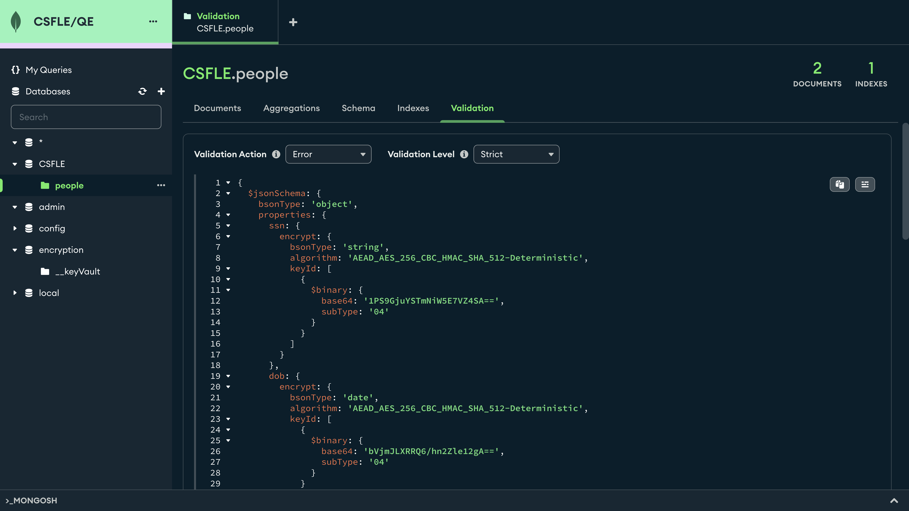
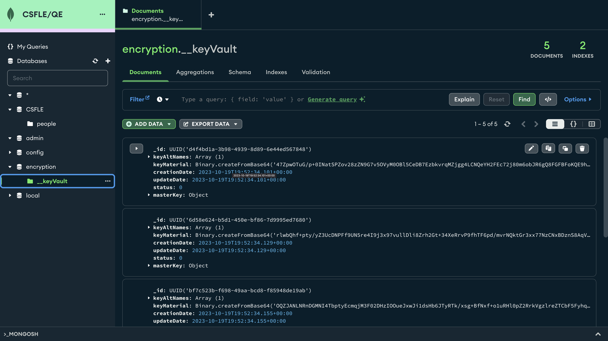
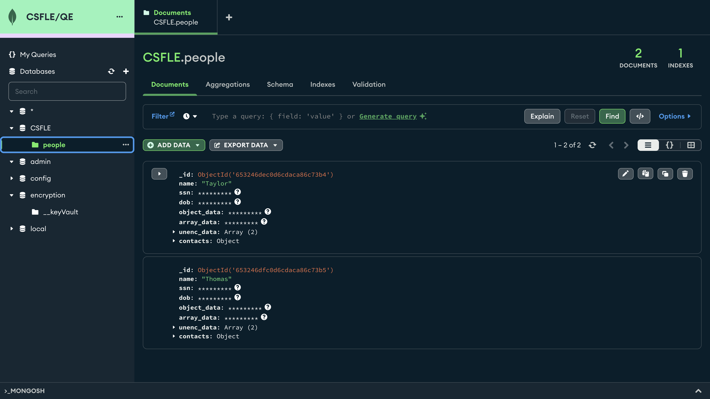
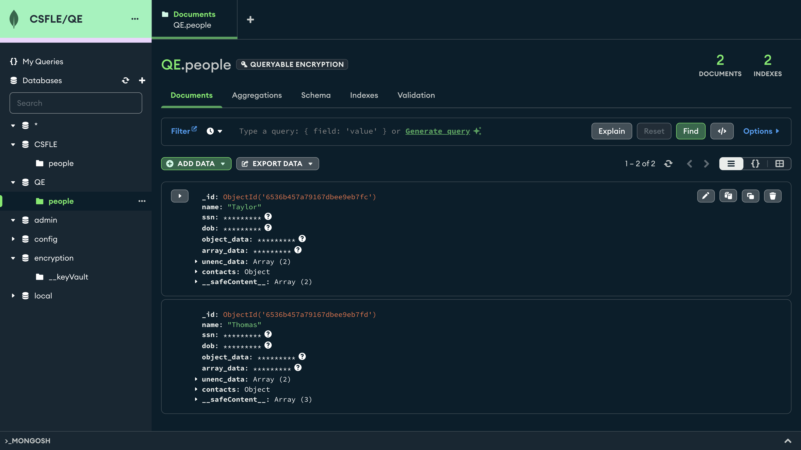
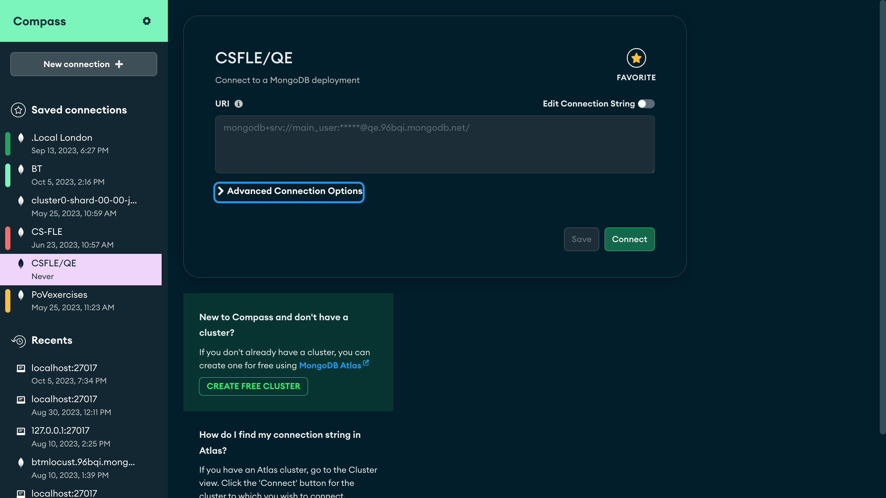
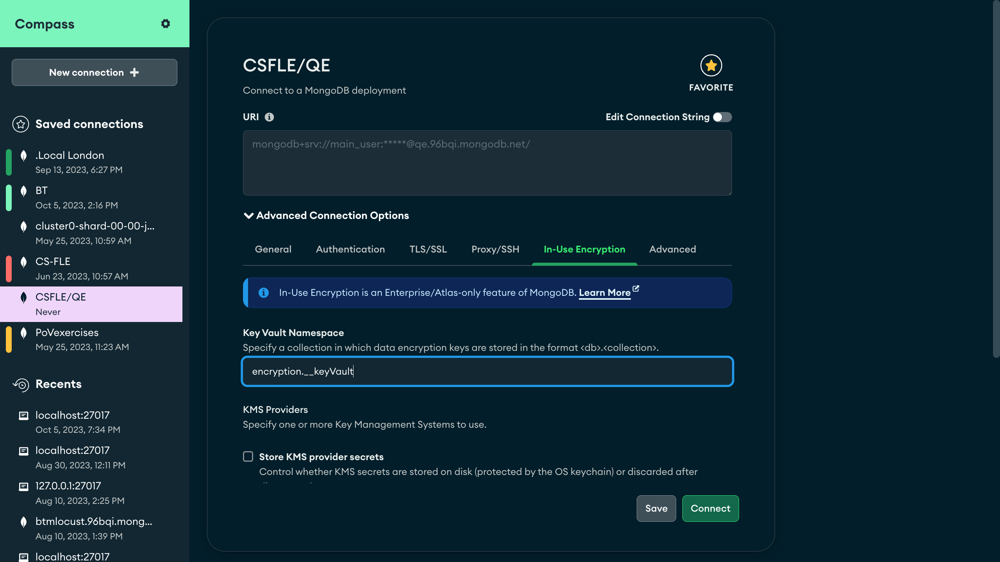
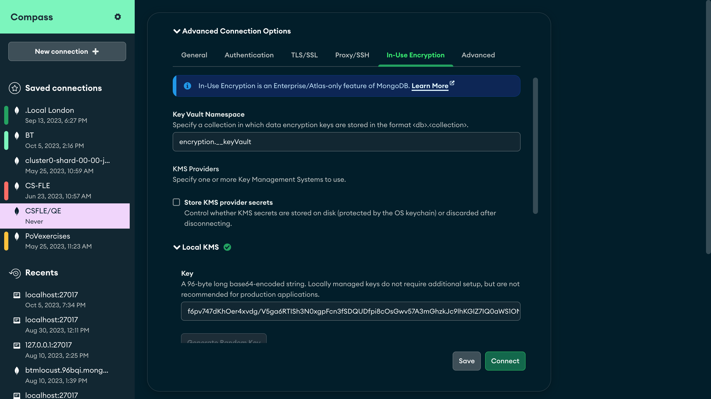
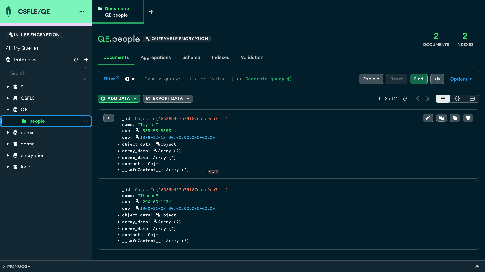

# ENCRYPT-FIELDS

__Ability for a client application to encrypt specific database fields at the application tier using encryption keys only accessible to the client, thus preventing any database/server-side access to the data__

__SA Maintainer__: [Steve Walsh](mailto:steve.walsh@mongodb.com) <br/>
__Time to setup__: 30 mins <br/>
__Time to execute__: 15 mins <br/>
__TODO__: add more pauses to output <br/>


---
## Description

This proof shows how MongoDB can be configured to allow applications to leverage Client-Side Field Level Encryption (CS-FLE) a feature released in MongoDB 4.2. CS-FLE allows applications to encrypt fields in documents prior to transmitting data over the wire to the server.

MongoDB 4.2+ Enterprise supports *automatic* field level encryption using JSON schema syntax. Applications must modify only the driver client object configuration code to include automatic encryption settings. All read/write operations to a cluster via the encryption-configured client are automatically encrypted and decrypted using the predefined automatic encryption rules. Application code that uses the MongoDB standard CRUD operations does not require any additional modification to beging to leverage CS-FLE.

Only applications with access to the correct encryption keys and database can encrypt and write / decrypt and read the protected data. 

MongoDB Enterprise 7.0 has now added the revolutionary (many believed it could not be done!) Queryable Encryption, there is no longer a need to pre-define the server-side validation schema, as well as allowing the keys to be submitted in a non-determinstic format each time a key is transmitted to/from the server. Genius!

Consider the following document -

```json
{
   "_id" : ObjectId("5db2e8bf6bf42af9e6753949"),
   "name": "Taylor",
   "ssn": "555-55-5555",
   "dob": new Date("1989-12-13"),
   "object_data": {record:1, num: 12345678},
   "array_data":[{foo:1, bar:2}, "secret"],
   "unenc_data":[{foo:1, bar:2}, "notsecret"],
   "contacts": {
      "address1": "123 Main St",
      "city":     "New York",
      "state":    "NY",
      "postal":   "10281",

      }
}
```

With client-side field level encryption, the application can specifically encrypt sensitive information like the `ssn`, `mobile` and `email` fields. Encrypted fields are transmitted to and from the database as [`binary data`](https://docs.mongodb.com/manual/reference/mongodb-extended-json-v1/#data_binary) with [`subtype 6`](https://github.com/mongodb/specifications/blob/master/source/client-side-encryption/subtype6.rst).

```json
{
   "_id": ObjectId()"6536b457a79167dbee9eb7fc"),
   "name": "Taylor",
   "ssn": BinData(6,
   "Dht5htxrY0pDkQJbsc8q/uECBBKOf23u3KgUAGnG0k04DE17wXgJNhu6Bq9zH31vuLxjbGhihKdCworzyA2GyUTvfwrpGDadsLU4ZMWyRRUJaojQhcZ5+b2BeyE/S+yA5V2xvX4I7+cZ2AKKu8cTfCi18A1AFf7Uct9Fw4ZNySogYkoEGMrqzJjyhdgE6LdwjVG9EMh2VpwXiuxlWdESPXI2B8PmZwtjrXcGUOczyg7ykOR3sKJlnn7gzCgdta6ma/F/MndQRqAZ7QfJftP+KohheVuciEDga3dy38YyBF/7Qw=="),
   "dob": BinData(6,
   "Dk10yO7rgEXkqR54aJTQDXYJ46WtmGF88+aLPJfe17NZb5Yty3O+4GllD2/QHqobDmcdyMiAXWuZAslGE6TF1SwgsCRO1GO7XPpgxUo26ywVahWPBaZD4/KsyfqUfz5/X/bkyR73oNA42dX+WjFePgh44TP01SqDNECbFjOr2vuK6qot/BGR5Fe1BIzLBxj2vKC1i0F4JUG0EkM2MKi2DNrBBDzRxSPNV23GNc8KYm+4dDSnw6Al2ehvEVwaRvt5w4Sd5xNT19TT8e0ATOxhVCYG"),
   "object_data": BinData(6,
   "ECfz1mEJHEF7gWxi5xuirPMDN9BNudSDY6dfDE/6mveVO2D1xmEK2BdrhjBjSAyTFkw7Mi0x1CjTCm/Lskq/ompjjp62E44cL6HVm0Lv5cDBOBsfqcvT2kQ7I23kHZrL1a8="),
   "array_data": BinData(6, 
   "EFrtkIXAEUGpiMr9JhTBP6EE0yWN7s6ZxHODV2MMaquXjr/oMP3XHY0NnSq7tW3ndSRtKvO/oD5CZEMHacEsSN5oq09ekAMnvbMAKJE0eW77zi0CMCV79uiM80DrFGSjfbgqm90rrjzIJFWZaIWm6Zw5"),
   "unenc_data": [
     {
       "foo": 1,
       "bar": 2
     },
     "notsecret"
   ],
   "contacts": {
      "address1": "123 Main St",
      "city": "New York",
      "state": "NY",
      "postal": "10281"
   },
   "__safeContent__": [
      {
        BinData(6,
        "B8PmZwtjrXcGUOczyg7ykOR3sKJlnn7gzCgdta6ma/E=",
      },
      {
        Bindata(6,
        "tYtBeCVBtBJDNjCotgzawQQ80cUjzVdtxjXPCmJvuHQ=",
      }
  ]
}
```

For this proof we will create a MongoDB 7.0 Enterprise cluster in Atlas, connect to it via the MongoDB Nodejs driver and configure the following:

- The key vault namespace (`demoFLE.keystore`) used to store encrypted data keys
- A Local Master encryption key file to use
- Per-field encryption rules using JSON schema syntax
  - one key for the `ssn`
  - another key for the `mobile`and `email`

We will then insert some documents and validate the fields contain encrypted data. We will also validate that a client, without knowledge of the keys, only sees cipher text in both the shell and MongoDB Compass for the affected fields.

Applications with [`read`](https://docs.mongodb.com/manual/reference/built-in-roles/#read) access to the key vault collection can retrieve data keys by querying the collection. However, only applications with access to the Customer Master Key (CMK) used to encrypt a data key can use that key for encryption or decryption.

Note, using a 'Local' Master encryption key is not recommended for production use. If you prefer to use AWS KMS service for the CMK, follow this separate article. For complete documentation on data key management, see [Manage Client-Side Encryption Data Keys](https://docs.mongodb.com/manual/tutorial/manage-client-side-encryption-data-keys/).

---
## _Client-Side Field Level Encryption_

## Setup

**1. Configure Laptop**

- Ensure Nodejs is installed on your computer
- Ensure MongoDB version **7.0 enterprise** Automatic Encryption Shared Library is already installed on your computer
   - _NOTE_: MongoDB Enterprise is no longer needed for the automatic association and use of encryption keys, since the new library supercedes the old **mongocryptd** library. MongoDB 7.0 Enterprise extends 4.2-compatible driver encryption support to include [automatic field level encryption](https://docs.mongodb.com/manual/core/security-client-side-encryption/#field-level-encryption-automatic) using [JSON schema syntax](https://docs.mongodb.com/manual/reference/security-client-side-automatic-json-schema/#field-level-encryption-json-schema). Please note the types of encryption that can be [used](https://docs.mongodb.com/manual/core/security-client-side-encryption/#encryption-algorithms). Download it following the instructions at https://www.mongodb.com/docs/manual/core/queryable-encryption/reference/shared-library/#std-label-qe-reference-shared-library-download
- [Download](https://www.mongodb.com/download-center/compass) and install Compass on your laptop

**2. Configure Atlas Environment**

- Log-on to your [Atlas account](http://cloud.mongodb.com) (using your SA Atlas account and navigate to your SA project
- In the project's Security tab, choose to add a new user called **main_user**, and for **User Privileges** specify **Atlas Admin** (make a note of the password you specify)
- Create an **M10** based 3 node replica-set in a single cloud provider region of your choice with default settings except __specify the MongoDB version to be 7.0__
- In the Security tab, add a new **IP Whitelist** for your laptop's current IP address

**3. Generate a Locally Managed Key to be Used as the Master Key as our Key Management Service (KMS)**

This key will be used for storing and retrieving a Customer Master Key (CMK)

- Configuring client-side field level encryption for a locally managed key requires specifying a base64-encoded 96-byte string with no line breaks. In the command line terminal of your laptop, run the following to create a file with the javascript environment variable ready to be used later

```javascript
// For Linux & Mac:
echo $(head -c 96 /dev/urandom | base64 | tr -d '\n') > master-key.txt

// For Win 10/2016+:
powershell -command "[Convert]::ToBase64String((1..96|%{[byte](Get-Random -Max 256)}))" > master-key.txt

// Note: Get-Random in Windows 10/Server 2016 uses a CSPRNG seed by default. Prior to PS 5.1, seed was system clock.
```

-  Locate this key file on your local file system, in the directory containing the master credentials.js. 

  *Example: `master-key.txt`*

```?o??*???ov???E2?st?
?b?ìH4
??%?e???g?ѥ??????c?`?hVW@Ѽ
                          ?W??$?????3~8?s% 
```

  

**WARNING** - *A local key file like this should ONLY be used for development & testing, never in production. A KMS should be used in production.*

**4. Customise files for your environment**

- Modify the top-level (in the same directory as CSFLE and QE sub-directories) **credentials.js**. Ensure the MONGODB_URI variable is set to your Atlas URI and the SHARED_LIB_PATH is set to the location of the downloaded automatic encryption library e.g. **/Users/steve.walsh/Downloads/mongo_crypt_shared_v1-macos-x86_64-enterprise-7.0.1/lib/mongo_crypt_v1.dylib**

Note that **credentials.js** in both the _CSFLE_ and _QE_ subdirectories is soft-linked to the master one in the main directory.

**5. In Compass, enter the URI of your Atlas cluster and confirm successful connection**

- In the Atlas console, for the database cluster you deployed, click the **Connect button**, select **Access your data through tools -> Compass**, click **I have MongoDB Compass installed** and in the **Copy your connection string** section copy the connection string - paste this into Compass to connect to your cluster

**6. Show in create_data.js the people schema that will be Used for Both Client and Server Side**

```VSCode (or similar)
// Create people JSON schema that can be used for both defining the client side and server side. Note type enforced is only true for server-side JSON schema, not the "schema-lite" that drivers enforce, the client side ignores non "encrypt" elements.

  const peopleSchema = {
    [dataNamespace]: {
      bsonType: 'object',
      properties: {
        "ssn": {
          encrypt: {
            bsonType: 'string',
            algorithm: AEAD_DETERM,
            keyId: [ key1._id  ]
          }
        },
        "dob": {
          encrypt: {
            bsonType: 'date',
            algorithm: AEAD_DETERM,
            keyId: [ key2._id  ]
          }
        },
        "object_data": {
          encrypt: {
            bsonType: 'object',
            algorithm: AEAD_RANDOM,
            keyId: [ key3._id  ]
          }
        },
        "array_data": {
          encrypt: {
            bsonType: 'array',
            algorithm: AEAD_RANDOM,
            keyId: [ key4._id  ]
          }
        },
        "contacts":{
          bsonType: 'object',
          properties: {
          "mobile": {
            encrypt: {
            bsonType: 'string',
            algorithm: AEAD_RANDOM,
            keyId: [ key5._id ]
          }}}
        }
      }
    }
  };
```

Validate with MongoDB Compass the schema validation is in place on the server side



---
## Execution

**At the Unix/Windows shell command prompt**

**1. Enter the CSFLE directory**

```shell
   % cd CSFLE
```

**2. Execute the script**

```shell
   % ./_run.bash
```
 
**3. Generate New Field Keys Using Master Key to do Wrapping Encryption**

When it has created the keys and states **Press any key to continue...**, you can validate the creation of these keys in MongoDB Compass, worth noting that the keyMaterial is encrypted with the CMK.



**4. Continue and insert data**

Hit &lt;RETURN&gt; to continue

Note the output from the script, showing first how it queries from an encyryption-enabled client session and then from a non-enabled session (showing similar to what we see in Compass in step 5)

**5. Note how MongoDB Compass displays the data as cipher text to the non-authorised Admin**

```Compass
Connect to your Atlas cluster
Select the CSFLE database
Open the people collection
```
Highlight how the encrypted data is cipher text to those without the keys with MongoDB Compass



Since MongoDB Compass also has no knowledge of the CMK or Keystore collection usage, data that is encrypted is shown with stars, and these fields can not be edited.

Note that with the Automatic Encryption library, we can subsequently query using the keys without knowing the schema, since this is now stored within the collection metadata.

## _Queryable Encryption_

## Setup

_For inital setup, see steps 1-4 above under CS-FLE_

**~~1. Configure Laptop~~**

**~~2. Configure Atlas Environment~~**

**~~3. Generate a Locally Managed Key to be Used as the Master Key as our Key Management Service (KMS)~~**

**~~4. Customise files for your environment~~**

**~~5. In Compass, enter the URI of your Atlas cluster and confirm successful connection~~**

**6. Show in helloWorld.js the people schema that will be Used for Both Client and Server Side**

```VSCode (or similar)
  const collOptions = {
    'encryptedFields': { 'fields': [
      { path: 'ssn', bsonType: 'string',             queries: {queryType: 'equality'} },
      { path: 'dob', bsonType: 'date',               queries: {queryType: 'equality'} },
      { path: 'contacts.mobile', bsonType: 'string', queries: {queryType: 'equality'} },
      // not queryable encrypted fields
      { path: 'object_data', bsonType: 'object' },
      { path: 'array_data', bsonType: 'array' }
    ]}
  };
```

Validate with MongoDB Compass that no schema validation is in place on the server side


---
## Execution

**At the Unix/Windows shell command prompt**

**1. Enter the QE directory**

```shell
   % cd QE
```

**2. Execute the script**

```shell
   % ./_run.bash
```
**4. Insert data**

Note the output from the script, showing first how it queries from an encyryption-enabled client session and then from a non-enabled session (showing similar to what we see in Compass in step 5)

**5. Note how MongoDB Compass displays the data as cipher text to the non-authorised Admin**

```Compass
Connect to your Atlas cluster
Select the QE database
Open the people collection
```
Highlight how the encrypted data is cipher text to those without the keys with MongoDB Compass



Since MongoDB Compass also has no knowledge of the CMK or Keystore collection usage, data that is encrypted is shown with stars, and these fields can not be edited.

Note that with the Automatic Encryption library and Queryable Encryption, we can subsequently query using the keys without knowing the schema, which is no longer stored within the collection metadata.

Emphasise here that as a developer, this is _so_ easy and more query types will be coming soon for Queryable Encryption, as well as simple key lookups.

However, it should also be noted that Queryable Encryption does come at a price, in terms of additional storage and compute.

## _Configuring Compass to view/modify encrypted data_

Compass provides an option known as **In-use Encryption** to allow both the viewing and modification of encrypted data. 

## Process

**In Compass, when building/editing your connection**

**1. Select Advanced Connection Options**



**2. Click on the In-Use Encryption Tab**

Enter the Key Vault Namespace



And then the local KMS key from _master-key.txt_ in our current case, but you could also add an external KMS.



**3. Connect to your cluster**

Click Connect and now you will be able to view and edit encrypted data

