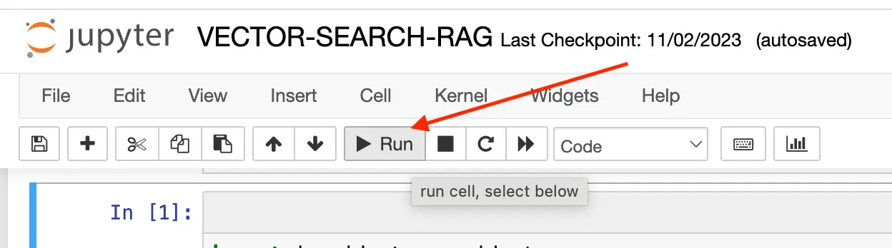
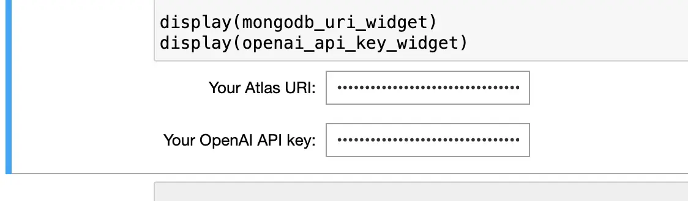
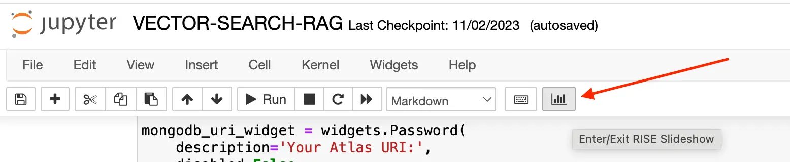
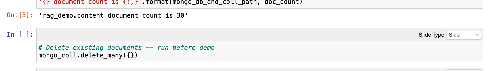
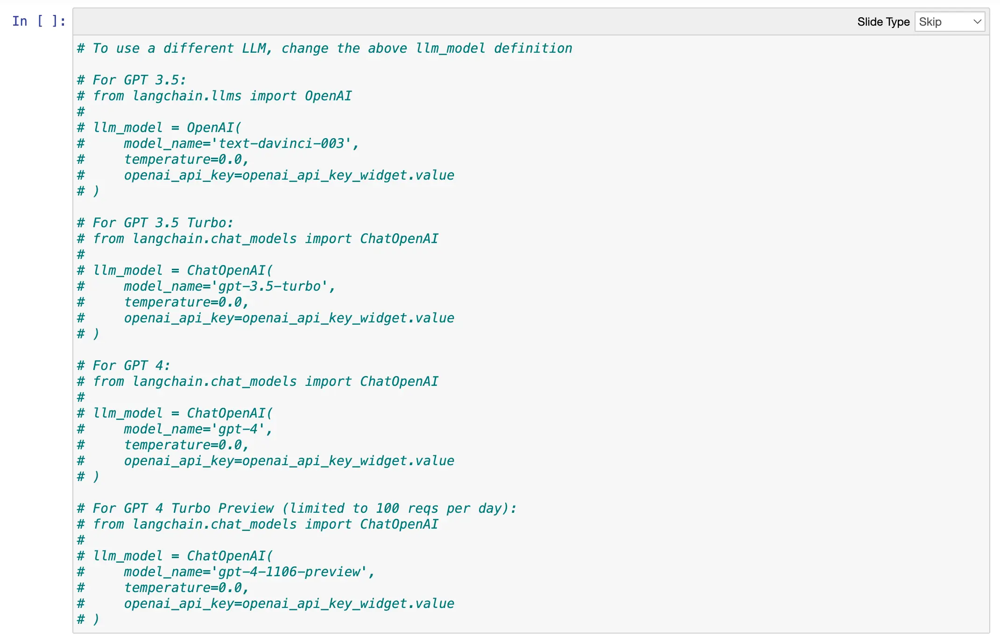
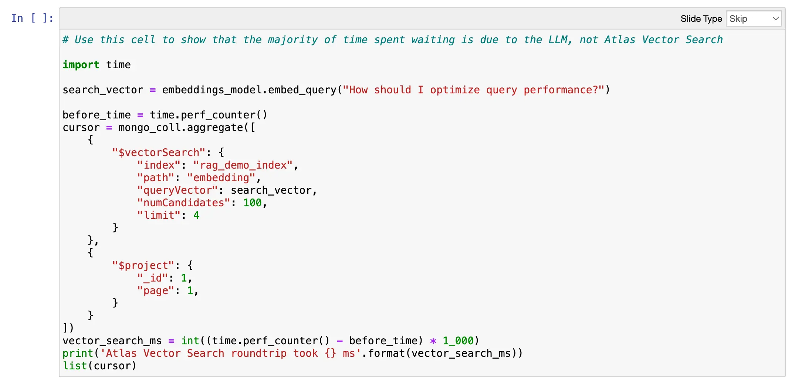

# RETRIEVAL AUGMENTED GENERATION (VECTOR SEARCH)

Enabling generic Large Language Models (LLMs) to answer questions based on knowledge not provided or available during their original training.

SA Maintainer: [Charles Burnett](mailto:charles.burnett@mongodb.com) <br/>
Time to setup: 5-30 mins <br/>
Time to execute: 30 mins <br/>

___
## Description

In order to truly unlock the power of LLMs, organizations need to not only access the innovative commercial and open-source models but also feed them vast amounts of quality internal and up-to-date data. By combining a mix of proprietary and public data in the models, organizations can expect more accurate and relevant LLM responses that better mirror what's happening at the moment.

The ideal way to do this today is by leveraging retrieval-augmented generation (RAG), a powerful approach in natural language processing (NLP) that combines information retrieval and text generation. Most people by now are familiar with the concept of prompt engineering, which is essentially augmenting prompts to direct the LLM to answer in a certain way. With RAG, you're augmenting prompts with proprietary data to direct the LLM to answer in a certain way based on contextual data. The retrieved information serves as a basis for generating coherent and contextually relevant text. This combination allows AI models to provide more accurate, informative, and context-aware responses to queries or prompts.

(Description source: https://www.mongodb.com/blog/post/retrieval-augmented-generation-rag-open-book-test-gen-ai)

This proof contains a Jupyter Notebook which is designed to:

* Take a URL to a PDF as input
* Break it down into smaller chunks
* Create vector embeddings for each chunk
* Store the chunks w/ embeddings in MongoDB Atlas
* Define an Atlas Vector Search index for the chunks 
* Query a Large Language Model, passing in the most relevant chunks as context

---
## Setup

### Option 1: Run via mSide

This notebook can be run via a hosted Jupyter instance. Navigate to https://specialists.sa.prod.corp.mongodb.com/Search/Notebooks and click the Launch icon for `VECTOR-SEARCH-RAG.ipynb`.

### Option 2: Run locally via laptop

1. Install Python 3.9+
1. Install Python packages in [requirements.txt](requirements.txt). This will install Jupyter Notebook 6.x, as well as the Python libraries for pymongo, langchain and openai. If you'd rather use Jupyter Notebook 7, or JupyterLab, feel free. But note that the slideshow feature via the RISE plugin may not be fully functional.
```bash
pip3 install -r requirements.txt
```
1. Start Jupyter Notebook
```bash
jupyter notebook
```
1. Open `VECTOR-SEARCH-RAG.ipynb`

## Execution

1. Click the first cell with code and then click Run
    
    1. You can now provide the following into the two password widgets:
        1. A connection string to your own personal Atlas cluster
        1. An OpenAI API key which has been loaded with credits
    1. If you're showing this as a demo to a customer, be sure to perform this step prior to sharing your screen
    
1. To run the notebook in slideshow mode, click the icon on the toolbar which looks like a bar chart. For best results, place your browser into "full screen" mode

1. While in slideshow mode, use the following keyboard shortcuts
    * To advance a cell without executing, or to advance to the next slide, use __Space__
    * To execute the code in the current cell, use __Shift+Enter__
1. There are some hidden cells which will not show up in slideshow mode:
    1. A cell to delete the documents in your rag_demo.content collection (such as before/after each demo)
    
    1. A cell which provides different code blocks for experimenting with different versions of GPT
    
    1. A cell which can be used to show how quickly Atlas Vector Search returns relevant chunks (to contrast with the slowness of the LLM for certain queries)
    

### Additional Notes

* The first time you create the search index ("Create MongoDB Atlas vector search index"), it may take a few minutes to complete. Thus, if you're demonstrating this to a customer, you may want to ensure that the index is created prior to the demo to save time. If the search index already exists, and you try to create it again, you'll get a message such as `IndexAlreadyExists`. This is not a problem.
    * If you delete the rag_demo.content collection, it will delete the index, and you'll have to create it again later. If you instead only delete the documents within the collection (a la the hidden cell mentioned above), the search index will remain and will not need to be created on the next run-through. As new chunks are added to the collection, they will be automatically indexed for vector search purposes.
