# STREAM-PROCESSING

<link rel="stylesheet" href="./css/styles.css">

Ability to use a single platform, API, query language, and data model to:

* continuously process, query, analyze, and react to streaming data and application data stored in the database,
* continuously validate schema to check that events are properly formed before processing, and
* continuously materialize views into Atlas database collections

SA Maintainer: [Roy Kiesler](mailto:roy.kiesler@mongodb.com)<br/>
Time to setup: 30 mins<br/>
Time to execute: 30 mins

## Setup

1. **Prerequisites**
   * Mongo Shell (`mongosh`) or
   * **Optional**: Visual Studio Code (with [MongoDB for VS Code](https://code.visualstudio.com/docs/azure/mongodb) extension installed)

1. **Configure Atlas**
   * Log-on to your [Atlas account](cloud.mongodb.com) (using the MongoDB SA preallocated Atlas credits system) and navigate to your SA project
   * Create an M10 cluster in AWS using region of your choice. You can also re-use an existing cluster in AWS.

1. **Configure Kafka**
   * Log-on to [Cofluent Cloud](https://confluent.cloud) (using your Github or Google MongoDB account)
   * Create a Kafka cluster in the same/nearest cloud provider and region as your [Atlas Stream Processing instance](https://www.mongodb.com/docs/atlas/atlas-sp/limitations/#:~:text=Atlas%20Stream%20Processing%20is%20currently%20only%20available%20on%20AWS%2C%20in%20the%20US%2DEAST%2D1%20region.). For the purpose of this PoV proof, a Basic cluster will suffice (note the expected cost of $0.11/GB of reads and writes, respectively. Also, if you are new to Confluent Cloud, your account may receive a $400 free credit. Check the [billing page](https://confluent.cloud/settings/billing/invoice) to verify.) For example:
   

   <div class="note">
      <b>Note:</b>&nbsp;Atlas Stream Processing is currently available in AWS only. While you can create your Kafka cluster in other cloud providers, doing so will incur additional data transfer costs.
   </div>

   * Navigate to the Connectors list on your newly created cluster, and select the Datagen source connector.
     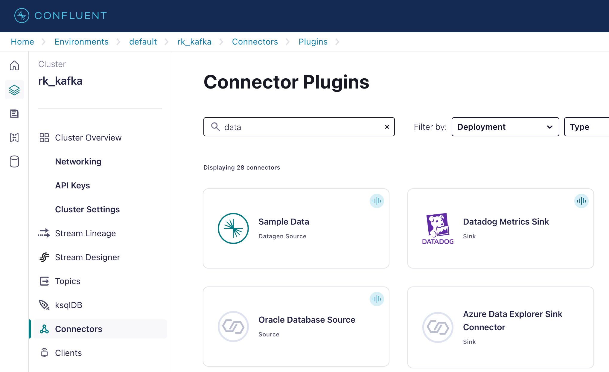
   * Deploy the Datagen source connector using the Orders template.
     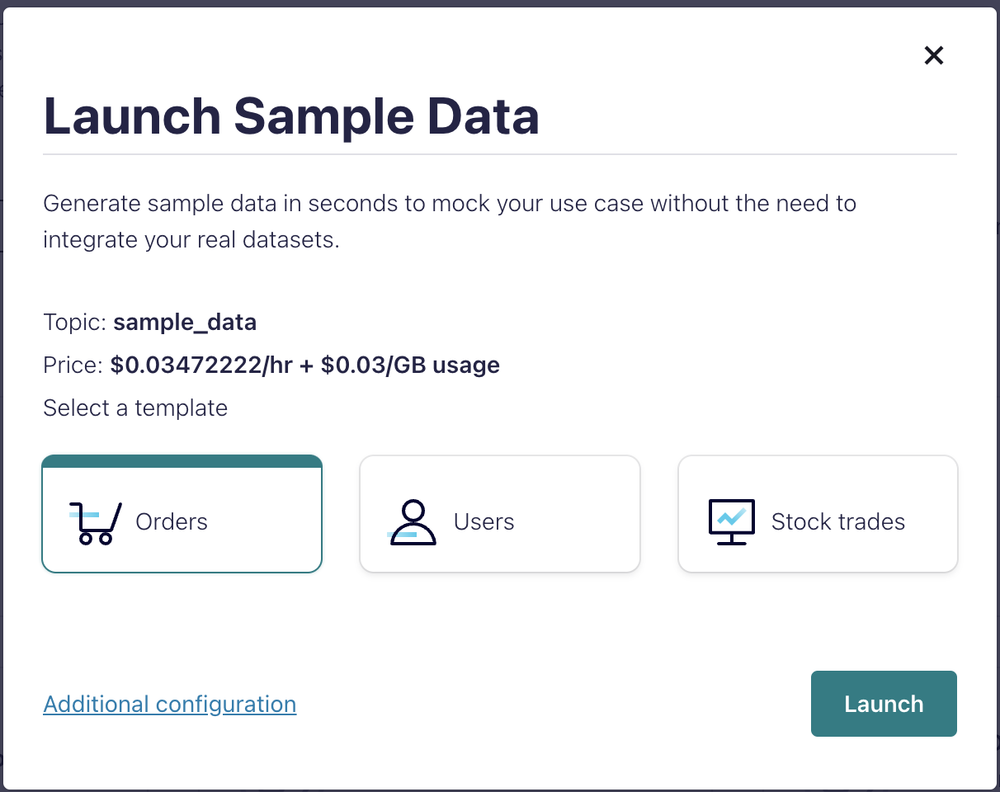
     Use `datagen-orders` when prompted to create a new topic, and accept all other default settings.
   * Generate an API key and be sure to download and save the generated key and secret in a safe place.
     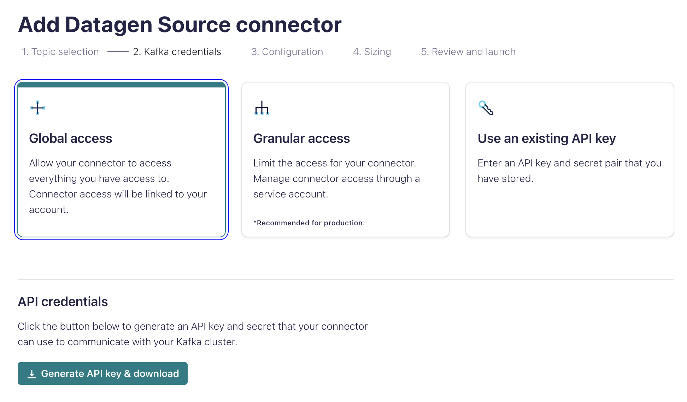
   * Select the JSON record format and the Orders template.
     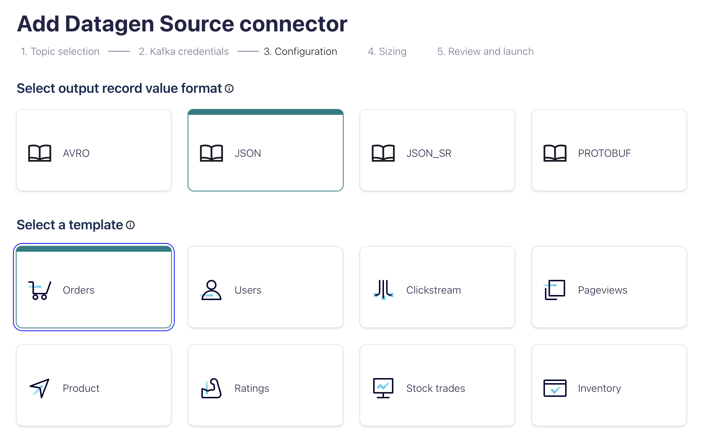
   * Accept the remaining default settings and finish the deployment process.
   * Navigate to the Topics list, locate the `datagen-orders` topic and verify that messages are being published to the topic.
   * You may pause the Datagen source connector until you"re ready to consume messages.
   * Navigate to the Clients list and create a new consumer client.
     
     Select any language (e.g., Python, Node.js, etc.) to see the connection information. For example:

     ```properties
     # Required connection configs for Kafka producer, consumer, and admin
     bootstrap.servers=xxx-xxxxx.<region>.<cloud>.confluent.cloud:9092
     security.protocol=SASL_SSL
     sasl.mechanisms=PLAIN
     sasl.username={{ CLUSTER_API_KEY }}
     sasl.password={{ CLUSTER_API_SECRET }}
     
     # Best practice for higher availability in librdkafka clients prior to 1.7
     session.timeout.ms=45000
     ```

1. **Configure Atlas Stream Processing**
   * In the Atlas Stream Processing UI, Add a new Kafka connection to the Connection Registry using the properties in the previous step. For example:
      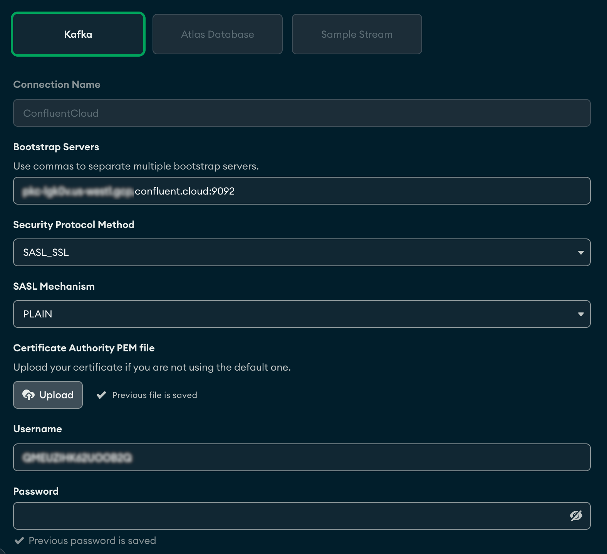

   * NEXT, ADD a new Atlas cluster connection named `MongoDBAtlas`, pointing to an Atlas cluster.

   * [Re]start the Datagen Orders source connector in Confluent Cloud and verify that messages are being published to the topic.

   * In the Atlas UI, navigate to the Atlas Stream Instance and click the **[Connect]** button. Connect to your Stream Processing Instance from `mongosh`:

     ```bash
     mongosh "mongodb://atlas-stream-xxxxxxxxxxxxxxxxxxxxxxxx-xxxxx.virginia-usa.a.query.mongodb.net/" --tls --authenticationDatabase admin --username <user>
     ```

   * **Optional**: If you prefer to use VS Code and the MongoDB extension instead of the MongoShell, copy the connection string for VS Code.
     

     In the MongoDB extension for VS Code, add a new connection and paste the connection string you just copied.
     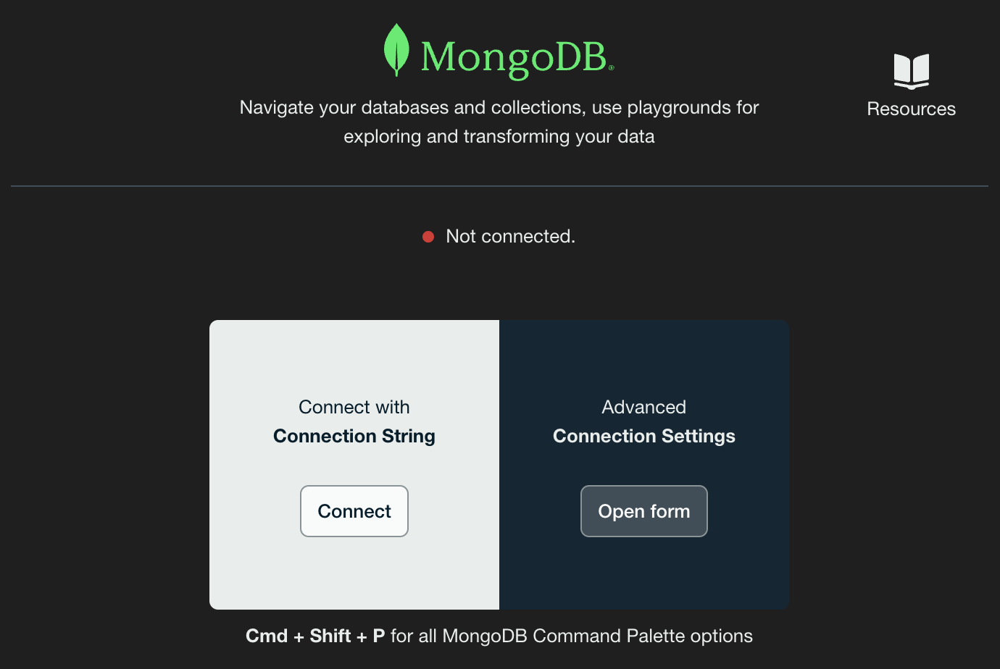

     Once connected, create a new MongoDB Playground, where you can type and execute all commands to follow.

   * Execute the following command In `mongosh` or the VS Code playground:

     ```js
     sp.process([{
        $source: {
           connectionName: "ConfluentCloud",
           topic: "datagen-orders"
        }}
     ])
     ```

     Order messages should start streaming in the shell, e.g.:

     ```js
     {
        ordertime: Long("1511841196031"),
        orderid: 12610,
        itemid: "Item_58",
        orderunits: 3.7123774156325866,
        address: {
           city: "City_7",
           state: "State_",
           zipcode: 81790
        },
        _ts: ISODate("2024-02-08T16:33:37.926Z"),
        _stream_meta: {
           sourceType: "kafka",
           sourcePartition: 3,
           sourceOffset: 2304,
           timestamp: ISODate("2024-02-08T16:33:37.926Z")
        }
     }
     ```

     Press Ctrl+C to stop the console stream.

## Execution

1. **Write order events to a MongoDB collection.**

   * In you Atlas cluster, create a new database named `datagen` and a collection named `orders`.

   * In `mongosh` or the VS Code playground, define the following objects:

     ```js
     let src = {
        $source: {
           connectionName: "ConfluentCloud",
           topic: "datagen-orders",
        }
     }

     let merge = {
        $merge: {
           into: {
              connectionName: "MongoDBAtlas",
              db: "datagen",
              coll: "orders"
           }
        }
     }
     ```

   * Create a new Stream Processor ([doc](https://www.mongodb.com/docs/atlas/atlas-sp/manage-stream-processor/#create-a-stream-processor)):

     ```js
     sp.createStreamProcessor("datagen_orders", [src, merge])
     sp.listStreamProcessors() // <== verify processor was created
     ```

   * Start the newly created Stream Processor:

     ```js
     sp.datagen_orders.start()
     sp.datagen_orders.stats()  // <== repeat 2-3 times to see progress
     ```

   * Verify orders are written to the target `datagen.orders` collection:
     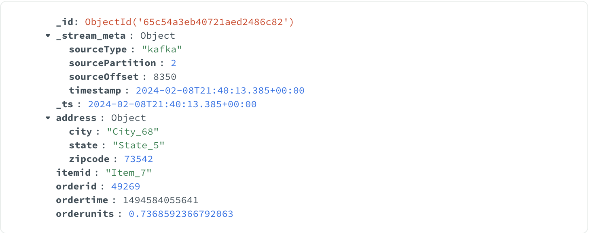

1. **Transform order events before storing**

   Note that in the documents we persisted to MongoDB in the previous step, the `orderunits` field contains a floating point number, which makes little sense in a retail/commerce scenario (this is not an error -- it's how the data is generated by the Datagen Kafka connector). We will convert that value to an integer in this next step.
   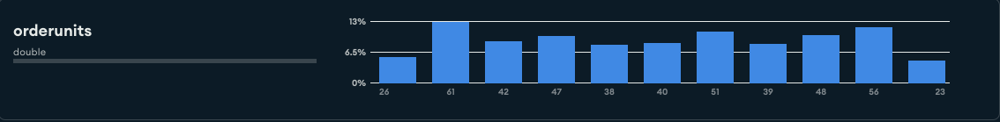

   * Execute the following commandsIn `mongosh` or the VS Code playground:

     ```js
     sp.datagen_orders.stop()
     sp.datagen_orders.drop()

     let makeInt = {
        $set: {
           orderunits: {
              $round: ["$orderunits", 0]
           }
        }
     }

     sp.createStreamProcessor("datagen_orders", [src, makeInt, merge])
     sp.datagen_orders.start()
     ```

   * Verify orders are written to the target `datagen.orders` collection with an integer values for the `orderunits` field:
     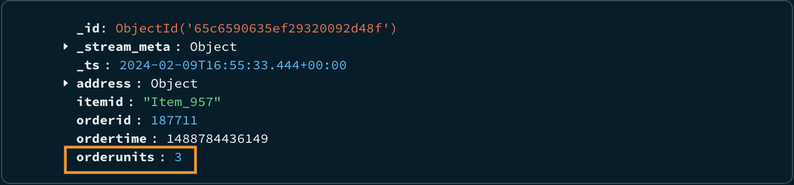

1. **Validate streaming documents conform to a schema of expected ranges, values, or datatypes.**

   If you inspect the sample orders (you can use the schema analysys view in Compass) you"ll notice that most values for the `address.city` and `address.state` fields are formatted as "City_\<n\>" and "State\<n\>" where "\<n\>" is an integer, e.g., "City_7", "State_4".
   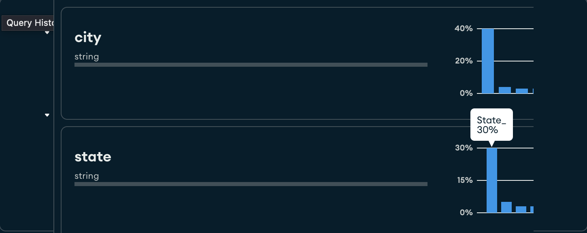

   However, there are documents where the integer suffix is missing from the value, e.g., "State_", "City_". Let"s address this issue by using JSON schema to enforce the integer suffix and store non-conforming documents in a dead letter queue.

   * Create a new collection in the `datagen` database named `dlq`. Also, delete all existing documents from the `datagen.orders` collection.

   * Execute the following commandsIn `mongosh` or the VS Code playground:

     ```js
     sp.datagen_orders.stop()
     sp.datagen_orders.drop()

     let validate = {
        "$validate": {
            validator: {
              "$jsonSchema": {
                 "required": ["address"], 
                 "properties": {
                    "address": {
                       "bsonType": "object", 
                       "required": ["city", "state", "zipcode"], 
                       "properties": {
                          "city": {
                             "bsonType": "string", 
                             "pattern": "City_\\d{1,3}"
                          }, 
                          "state": {
                             "bsonType": "string", 
                             "pattern": "State_\\d{1,3}"
                          }, 
                          "zipcode": {
                             "bsonType": "int"
                          }
                       }
                    }
                 }
              }
           },
           "validationAction" : "dlq"
        }
     }

     let dlq = {
        dlq: {
           connectionName: "MongoDBAtlas",
           db: "datagen",
           coll: "dlq"
        }
     }

     sp.createStreamProcessor("datagen_orders", [src, makeInt, validate, merge], dlq)
     sp.datagen_orders.start()
     ```

   * Verify non-conforming orders are written to the target `datagen.dlq` collection:
     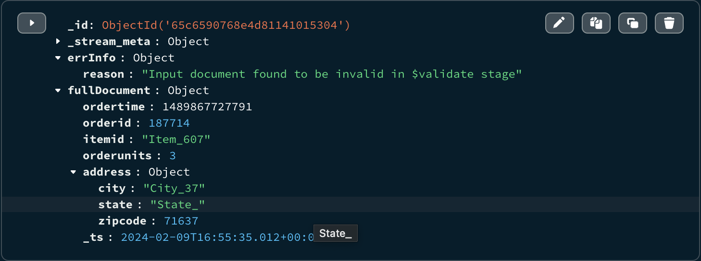

1. **Continuously query, analyze, and react to streaming data and materialize views into Atlas or Kafka.**

   In this step, we will persist aggregated streaming orders into our Atlas database, maintaining total order count, and maximum and average order unit counts by state.

   * Create a new collection in the `datagen` database named `analytics`.

   * Execute the following commandsIn `mongosh` or the VS Code playground:

     ```js
     sp.datagen_orders.stop()
     sp.datagen_orders.drop()

     let group = {
        $group: {
           _id: {
              state: "$address.state"
           },
           maxUnits: {
              $max: "$orderunits"
           },
           avgUnits: {
              $avg: "$orderunits"
           },
           totalOrders: {
              $sum: 1
           }
        }
     }

     let tw = {
        $tumblingWindow: {
           interval: {
              size: NumberInt(1),
              unit: "second"
           },
           pipeline: [group]
        }
     }

     let merge = {
        $merge: {
           into: {
              connectionName: "MongoDBAtlas",
              db: "datagen",
              coll: "analytics"
           },
           let: {value: "$totalOrders"},
           whenMatched: [{
              $addFields: {
                 totalOrders: {
                    $add:[ "$totalOrders", "$$value" ]
                 }
              }
           }]
        }
     }

     sp.createStreamProcessor("datagen_orders", [src, tw, merge])
     sp.datagen_orders.start()
     ```

## Measurement

The `datagen` database in your Atlas cluster should have the following populated collections: `analytics`, `dlq`, and `orders`.

## Cleanup

1. Stop and delete the stream processor

   ```js
   sp.datagen_orders.stop()
   sp.datagen_orders.drop()
   ```

1. Pause and/or delete the Datagen connector on your Confluent Cloud cluster.

1. Delete the Kafka cluster.

<div class="note">
   <b>Warning:</b>&nbsp;Do not forget to delete your Datagen connector and cluster when you are done with this POV. If you leave these on, your free credits will eventually deplete and you will incur charges!
</div>
