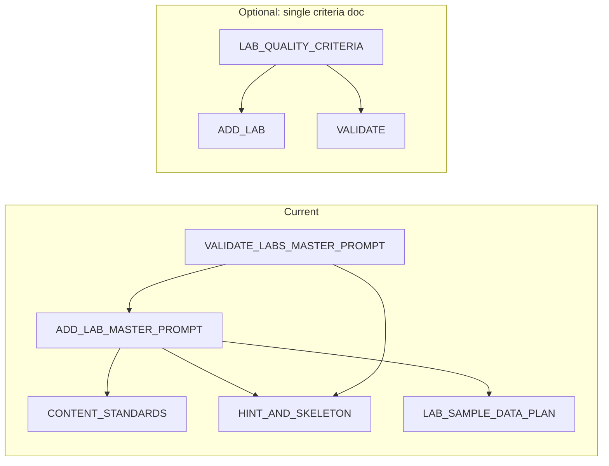

# ADD_LAB and VALIDATE_LABS Master Prompts – Analysis and Improvement Plan

## Scope

- **Primary docs:** [Docs/ADD_LAB_MASTER_PROMPT.md](Docs/ADD_LAB_MASTER_PROMPT.md), [Docs/VALIDATE_LABS_MASTER_PROMPT.md](Docs/VALIDATE_LABS_MASTER_PROMPT.md)
- **Key dependencies:** ADDING_AND_VALIDATING_LABS.md, CONTENT_STANDARDS.md, WORKSHOP_SESSION_AND_QUALITY_PRINCIPLES.md, HINT_AND_SKELETON_REFACTOR_PLAN.md, LAB_SAMPLE_DATA_PLAN.md, METADATA_DRIVEN_ENHANCEMENT_SYSTEM_COMPLETE.md, LAB_MIGRATION_GUIDE.md, validate-hint-rendering.test.ts, PLAN_GRAPH_TRAVERSAL_IRENE.md

---

## 1. Correctness issues

### 1.1 Step count inconsistency (ADD_LAB vs VALIDATE vs workshop doc)

- **ADD_LAB:** Uses both “5–6 steps (prefer 6)” (principal template, step count section, Master prompt) and “prefer 5–7 for hands-on” (mode table row 163, 172).
- **VALIDATE:** Uses “5–7 steps” in the checklist and Master prompt.
- **WORKSHOP_SESSION_AND_QUALITY_PRINCIPLES.md:** “5–7 for hands-on”.

**Change:** Pick one rule and use it everywhere. Recommended: **“Minimum 3; for hands-on labs 5–7 steps (prefer 6).”** Update ADD_LAB in all locations (principal template table, “Step count for hands-on”, Minimal mode table, “Self-contained labs”, Master prompt “require 5–6” → “5–7 (prefer 6)”) and keep VALIDATE and WORKSHOP_SESSION aligned.

### 1.2 blankText and hint-rendering test (explicit alignment)

- The test in [src/test/labs/validate-hint-rendering.test.ts](src/test/labs/validate-hint-rendering.test.ts) uses `PLACEHOLDER_REGEX = /(\$?)_{5,}(\.\w+)?/g` and validates that each hint’s `blankText` appears on the line (`lineText.includes(h.blankText)`) and that every placeholder from the skeleton has a matching hint (exact `line` + `blankText`).
- ADD_LAB describes this but does not cite the regex or “must equal the test’s extracted placeholder”.

**Change:** In ADD_LAB (Placeholder and hint authoring workflow) and in VALIDATE (Inline hints vs skeleton), add one sentence: “`blankText` must equal one of the placeholder strings extracted by the hint-rendering test’s regex: optional `$`, 5+ underscores, optional `.\w+` (see `validate-hint-rendering.test.ts`).” This reduces wrong blankText (e.g. full `$policies.________`_ when the test only extracts `_________`).

### 1.3 Merge vs overwrite enhancements (ADD_LAB)

- “After applying” says: “Create or overwrite enhancements.ts (if the POV folder already had enhancements, **merge** new entries instead of overwriting).”
- The Master prompt says: “Full content for … enhancements.ts” and “One entry per enhancementId **used in the lab**”, which can be read as “only this lab’s entries”.

**Change:** Make the merge rule explicit in the Master prompt: “If the POV folder already has an enhancements.ts file, add or update only the entries for this lab’s enhancementIds; do not remove or overwrite enhancements for other labs in the same POV.”

---

## 2. Efficiency and clarity

### 2.1 ADD_LAB length and repetition

- ADD_LAB is very long (~110k characters) and repeats the same rules in several places (no Terminal block, Run all / Run selection, skeleton + inlineHints, Lab 1 Step 3, mongosh when possible, etc.).
- The Master prompt block repeats the full quality bar again.

**Change:**

- Add a **short “Quick reference”** at the top (after “When to use”): one table with Steps (3 min; 5–7 hands-on), Hints (3–5 per step), Key concepts (4+), Prerequisites (incl. mongosh when Mongosh block), No Terminal block, skeleton + inlineHints, etc., with pointers to section names.
- In the Master prompt, replace long repeated paragraphs with: “Apply the **Principal quality template** and **Standardized approach (Lab 1 Step 3)** from this document; see sections [list section titles].” Keep one full checklist in the Principal quality template and reference it.

### 2.2 VALIDATE: criterion IDs for fix plans

- Fix plans list “Criterion” by name; long names make tables verbose.

**Change:** Introduce short **criterion IDs** in VALIDATE (e.g. L1 = Steps per lab, L2 = Key concepts, S1 = Narrative, E1 = No Terminal block, E2 = .cjs/.js = Lab 1 Step 3) and use them in the “Per-lab findings” table (e.g. “L2 | ❌ | Add 2 key concepts”). Optionally add a small reference table at the top of VALIDATE.

### 2.3 Single “criteria” doc to reduce drift

- ADD_LAB and VALIDATE both encode the same bar; when one is updated, the other can drift (e.g. step count, when to add Mongosh).

**Change (optional):** Add a single **Docs/LAB_QUALITY_CRITERIA.md** that lists lab/step/enhancement criteria in one place (steps count, key concepts, hints, prerequisites, dataRequirements, Terminal/skeleton/mongosh/C#/tips, hint placement). ADD_LAB and VALIDATE then “reference Docs/LAB_QUALITY_CRITERIA.md; the following sections add authoring and validation specifics.” This keeps one source of truth and reduces duplication.

---

## 3. Consistency of generated output (“not give consistent code”)

Interpretation: avoid **inconsistent or incorrect** code from the AI and avoid **cookie-cutter** labs that all look the same.

### 3.1 Correctness of generated code

- ADD_LAB already has “Validate query syntax” and “run full solution”; C# has test-run-csharp and InsertOne/InsertMany notes.

**Change:**

- In ADD_LAB, add an explicit **post-generation checklist** in “After applying” or in the Master prompt: “Before considering the lab complete: (1) Run the full solution code for each step (Node/mongosh/C#) once; (2) Run `validate-hint-rendering`; (3) Run `lab-step-verification-and-solution` if verificationIds are used.”
- In the Principal quality template, under “Validate query syntax”, add: “Use the **exact** operator and stage names from MongoDB docs (e.g. `$exists` not `exists` in partialFilterExpression); if unsure, run the solution in mongosh/Node and fix until it runs.”

### 3.2 Avoiding cookie-cutter content

- No current instruction to vary wording or avoid generic phrasing.

**Change:** In ADD_LAB, add a short **“Content variation”** bullet under the Principal quality template or “Avoid”: “Key concepts, narratives, and hints must be **specific to the lab topic** (e.g. aggregation stages, encryption terms, recovery concepts). Do not reuse the same generic phrases across labs; vary hint wording and narrative style so each lab reads distinctly.”

---

## 4. Missing aspects

### 4.1 ADD_LAB

- **requiredPrereqIds:** Mentioned in the “Per-lab required tools” section but not in the “Generate the following” list or the Master prompt output steps. Add: “Include `requiredPrereqIds` in the lab definition (subset of PREREQ_TOOL_IDS) when generating the lab file.”
- **Lab plan template:** Plan structure is described in text but not as a single checklist. Add a “Lab plan sections” list (e.g. in “Lab plan document”) matching PLAN_GRAPH_TRAVERSAL_IRENE.md: Objective and scope, Topic/POV/naming, Overview content, Data model and dataRequirements, Steps table, Enhancements pattern, Verification, Loader and registration, Lab definition updates, Tests and validation, Implementation order, File checklist.
- **Validate-by-topic (VALIDATE):** The “Validate by topic and lab name” prompt does not say to run the hint-rendering test for that scope. Add: “If the topic/lab has steps with skeleton + inlineHints, run `npm test -- --run src/test/labs/validate-hint-rendering.test.ts` (or simulate) for those labs and include any failures in the short report.”
- **Error handling / Run failures:** No guidance on tip text when Run fails (e.g. “If Run fails, check mongosh path in Workshop Settings”). Already covered indirectly by “mongosh path in Workshop Settings” tip; optional: add one line under Tips: “Where relevant, add a tip for common Run failures (e.g. mongosh path, .NET SDK, connection URI).”

### 4.2 VALIDATE_LABS

- **Verification stub follow-up:** The prompt says to list steps whose verification is stubbed and recommend implementing real checks; it does not say to add a “Stubbed verifications” subsection in the fix plan with lab id, step id, verificationId, and suggested check. Add that to the Output format.
- **requiredPrereqIds:** Not in the checklist. Add a lab-level criterion: “requiredPrereqIds: present and matches lab’s actual needs (atlas, mongosh, node, npm, dotnet when C#, etc.).”

### 4.3 Dependencies

- **CONTENT_STANDARDS.md:** Says “3 steps minimum” and “2 modes minimum” but does not mention “5–7 for hands-on” or “requiredPrereqIds”. Consider adding one line: “Hands-on labs: 5–7 steps preferred; see ADD_LAB_MASTER_PROMPT. Lab definitions should set requiredPrereqIds where applicable.”
- **ADDING_AND_VALIDATING_LABS.md:** Already points to both master prompts; no change required except if you add LAB_QUALITY_CRITERIA.md, then add a sentence that the criteria are also summarized there.

---

## 5. Dependency and doc health

- **HINT_AND_SKELETON_REFACTOR_PLAN.md:** Describes “Solution = fill all placeholders” and “one placeholder per line”; ADD_LAB and VALIDATE are aligned with that. No change.
- **LAB_SAMPLE_DATA_PLAN.md:** dataRequirements (type collection/script, namespace/path) are correctly referenced in both prompts. No change.
- **WORKSHOP_SESSION_AND_QUALITY_PRINCIPLES.md:** Step count “5–7” should be unified with the chosen rule (5–7 prefer 6) once ADD_LAB is updated.
- **BROWSER_IDE_TERMINAL_REFACTOR_ARCHITECTURE.md / Phase 6:** Referenced for execution model; no change.

---

## 6. Summary of recommended edits

| Area                          | Doc                                 | Action                                                                                                        |
| ----------------------------- | ----------------------------------- | ------------------------------------------------------------------------------------------------------------- |
| Step count                    | ADD_LAB, VALIDATE, WORKSHOP_SESSION | Unify to “5–7 for hands-on (prefer 6)” everywhere.                                                            |
| blankText                     | ADD_LAB, VALIDATE                   | State that blankText must match the hint-rendering test’s extracted placeholder (cite regex).                 |
| Enhancements merge            | ADD_LAB                             | In Master prompt, state “merge with existing enhancements in same POV; do not overwrite other labs’ entries”. |
| Quick reference               | ADD_LAB                             | Add top-level Quick reference table and reference “Principal quality template” from Master prompt.            |
| Criterion IDs                 | VALIDATE                            | Add short IDs (L1, S1, E1, …) and use in fix plan tables.                                                     |
| LAB_QUALITY_CRITERIA.md       | New (optional)                      | Single criteria doc; both prompts reference it.                                                               |
| Post-gen checklist            | ADD_LAB                             | Require “run full solution once per step; run hint test; run verification test”.                              |
| Content variation             | ADD_LAB                             | Add “Content variation” / avoid cookie-cutter wording.                                                        |
| requiredPrereqIds             | ADD_LAB, VALIDATE                   | ADD_LAB: add to “Generate the following” and Master prompt; VALIDATE: add to lab-level checklist.             |
| Lab plan sections             | ADD_LAB                             | Add explicit “Lab plan sections” list matching plan template.                                                 |
| Validate-by-topic + hint test | VALIDATE                            | In “Validate by topic and lab name”, add running (or simulating) hint-rendering test for that scope.          |
| Stubbed verifications         | VALIDATE                            | Add “Stubbed verifications” subsection to fix plan format.                                                    |
| CONTENT_STANDARDS             | CONTENT_STANDARDS.md                | Optional: one line on 5–7 steps and requiredPrereqIds.                                                        |

---

## 7. Diagram: doc and criteria flow (current vs optional)

Implementing the “Correctness” and “Missing aspects” items first will have the highest impact; then efficiency and consistency; finally the optional single-criteria doc and CONTENT_STANDARDS tweak.