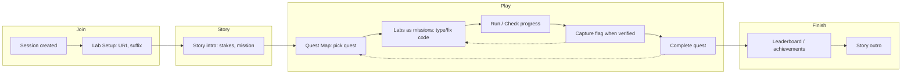

# Gamified, hands-on workshop: best approach and implementation flow

**Context:** Target audience = developers who should be **engaged** and **actually learn by doing** (hands on keyboard). Goal = **gamified, fun, engaging** workshop. This plan builds on [Docs/LEARNING_FIRST_LAB_ALTERNATIVES_PLAN.md](Docs/LEARNING_FIRST_LAB_ALTERNATIVES_PLAN.md).

---

## 1. Best approach for this audience

**Recommendation: Quest/Challenge as the default experience, with outcome-based success and fix-the-bug (or minimal scaffold) so “winning” = doing it, not filling blanks.**

| Goal                                   | How to achieve it                                                                                                                                                                                                                                                                                                                                                                                                                                                                     |
| -------------------------------------- | ------------------------------------------------------------------------------------------------------------------------------------------------------------------------------------------------------------------------------------------------------------------------------------------------------------------------------------------------------------------------------------------------------------------------------------------------------------------------------------- |
| **Engaged developers**                 | Strong narrative (story intro, stakes, mission); quest map and flags so progress is visible; optional timer or “first to capture” for competition.                                                                                                                                                                                                                                                                                                                                    |
| **Learn by doing (hands on keyboard)** | In Challenge mode, show **expertSkeleton** (minimal or no code) or **fix-the-bug** so learners type/fix real code; **verification** checks outcome (flag capture = you achieved the result). Reduce or remove fill-in-the-blank in challenge.                                                                                                                                                                                                                                         |
| **Gamified and fun**                   | Use existing pieces: [retail-data-breach-simulation](src/content/workshop-templates/retail-data-breach-simulation.ts) (storyIntro, storyOutro, questIds, gamification.basePointsPerStep, bonusPointsPerFlag, bonusPointsPerQuest, achievements). [QuestMapView](src/components/workshop/QuestMapView.tsx) (quest nodes, locked/unlocked, completed). Flags = clear goals; leaderboard = visibility. Add optional: time pressure, “first flag” callouts, quest completion celebration. |

**Concrete mix:**

- **Primary:** Challenge mode + Quests. Attendees see story → quest map → pick a quest → do labs as **missions** (objective or fix-the-bug), capture **flags** by passing verification. Points and leaderboard for steps + flags + quest completion.
- **Learning style in challenge:** Prefer **fix-the-bug** where possible (hands on keyboard, no blanks); otherwise **expertSkeleton** (minimal scaffold) so they write or complete code. Keep **outcome-only** for a later phase once schema supports it.
- **Guided (lab) mode:** Keep as optional “walkthrough” for anyone who wants more scaffolding; Challenge = default for “learn by doing.”

---

## 2. Attendee flow (how the workshop runs)

**Step-by-step:**

1. **Join:** Moderator creates a **Challenge** session (template with quests, e.g. Retail Data Breach). Attendees open Lab Setup, set MONGODB_URI and suffix (and any tools). Activate environment.
2. **Story intro:** Full-screen narrative (e.g. [storyIntro](src/content/workshop-templates/retail-data-breach-simulation.ts)): incident, stakes, mission (e.g. “Stop the Leak”, “Harden the System”), success criteria. Sets context and motivation.
3. **Quest map:** [QuestMapView](src/components/workshop/QuestMapView.tsx) shows quests; first quest unlocked. Attendee clicks a quest to open it.
4. **Labs as missions:** Inside the quest, labs are listed with quest-specific narrative ([labContextOverlays](src/content/quests/stop-the-leak.ts)). Each step is a **mission**: objective or “fix this code” (once brokenCode exists). Attendee works **hands on keyboard** (write or fix code), uses Run, then **Check progress**.
5. **Capture flag:** When verification passes for a step tied to a flag, the flag is captured (points, e.g. bonusPointsPerFlag: 25). UI can show a short “Flag captured” feedback.
6. **Complete quest:** When required flags for the quest are captured, mark quest complete (bonusPointsPerQuest: 50), optional achievement. Attendee can return to quest map and do the next quest.
7. **Leaderboard / achievements:** Points (steps + flags + quests) feed the leaderboard; achievements (e.g. “Encryption Guardian”) unlock. Keeps it competitive and visible.
8. **Story outro:** When all quests are done (or time’s up), show storyOutro: what they accomplished and impact. Closure and “we did it” feeling.

**What makes it “hands-on” and “learning”:** Success is **verification passing** (outcome), not “filled the blanks.” So either they write/fix code until it works (fix-the-bug / expertSkeleton) or, later, solve from an objective (outcome-only). Gamification is already in the flow; we just need challenge content (expertSkeleton / brokenCode) and real verification for every flag.

---

## 3. Implementation order and flow

**Phase 1 – No schema change (fastest path to “gamified + hands-on”)**

- **Default to Challenge for “learn by doing”:** In session wizard or docs, recommend Challenge mode (and a template with quests) when the goal is engagement and hands-on learning.
- **Content:** For labs used in challenge templates (e.g. CSFLE, QE, CRUD if added to a quest):
  - Add **expertSkeleton** to key steps: minimal scaffold (e.g. “// Connect and insert one doc with insertOne, two with insertMany; use db crud_lab, collection items”) or a very short stub so challenge mode doesn’t fall back to full fill-in-the-blank. Prompt change in ADD_LAB: “For labs that support challenge mode, define expertSkeleton (or objective text) so challenge shows minimal scaffold.”
  - Ensure **every flag** in those quests has a **verificationId** and that **VerificationService** implements a real check (no “run the code to verify” stubs). See [verificationService.ts](src/services/verificationService.ts); add cases for any missing flags (e.g. CRUD if you add a CRUD quest).
- **UX polish:** Optional: on flag capture, show a small toast or badge “Flag captured: …”; on quest complete, short celebration. Keeps the game feel.

**Phase 2 – Fix-the-bug (schema + one pilot)**

- **Schema:** Add optional `brokenCode?: string` to [CodeBlockMetadata](src/labs/enhancements/schema.ts). When present, no need for skeleton blanks.
- **StepView:** When a block has `brokenCode`, show it as the **initial editor content**; Run/Check progress unchanged; “Show solution” reveals `code` ([StepView](src/components/labs/StepView.tsx)).
- **Verification:** Implement outcome-based verification for the pilot (e.g. `crud.verifyConnectInsert` as in LEARNING_FIRST_LAB_ALTERNATIVES_PLAN).
- **Pilot:** One CRUD step (e.g. Connect and Insert) as fix-the-bug in a **new** challenge-friendly lab or as an alternate enhancement used only in challenge. ADD_LAB prompt: add “fix-the-bug” variant (brokenCode + code + verificationId; no blanks).

**Phase 3 – Outcome-only (optional, later)**

- After schema supports objective-only (objectiveMarkdown, optional referenceCode) and StepView shows objective + empty/minimal editor + Reference tab, add a few **outcome-only** steps so developers can “build from a spec” with only docs/reference. Use for 1–2 flagship challenge steps.

**Flow summary**

- **Content authors:** Use ADD_LAB (with new “challenge”/“fix-the-bug” rules) to add or update labs; always add real verification for any step that has a flag.
- **Moderators:** Create a Challenge session, pick a template with quests (e.g. Retail Data Breach), share URI and setup. Attendees follow: Story → Quest map → Labs (hands on) → Flags → Leaderboard → Outro.
- **Developers attending:** They see a story, choose a quest, then type or fix code until “Check progress” passes and flags are captured; points and leaderboard make it feel like a game while they learn by doing.

---

## 4. Files and touchpoints

| Area                                      | Files / touchpoints                                                                                                                                                                    |
| ----------------------------------------- | -------------------------------------------------------------------------------------------------------------------------------------------------------------------------------------- |
| Challenge as default for “learn by doing” | [WorkshopSessionWizard](src/components/settings/WorkshopSessionWizard.tsx), docs/README or workshop guide                                                                              |
| Quest + narrative + gamification          | [retail-data-breach-simulation](src/content/workshop-templates/retail-data-breach-simulation.ts), [stop-the-leak](src/content/quests/stop-the-leak.ts)                                 |
| Quest map and progress                    | [QuestMapView](src/components/workshop/QuestMapView.tsx), [ChallengeModeView](src/components/workshop/ChallengeModeView.tsx)                                                           |
| Points and flags                          | [gamificationService](src/services/gamificationService.ts), leaderboard utils                                                                                                          |
| Expert / challenge skeleton               | [schema.ts](src/labs/enhancements/schema.ts) (expertSkeleton), [StepView](src/components/labs/StepView.tsx) (tier selection), enhancements per lab                                     |
| Fix-the-bug                               | [schema.ts](src/labs/enhancements/schema.ts) (add brokenCode), StepView (initial content from brokenCode), [ADD_LAB_MASTER_PROMPT_V2](Docs/ADD_LAB_MASTER_PROMPT_V2.md) (variant rule) |
| Verification for flags                    | [verificationService.ts](src/services/verificationService.ts), flag definitions in quests (requiredFlagIds)                                                                            |

---

## 5. Summary

- **Best approach:** Quest/Challenge as the main experience, with **outcome-based success** (flags = verification passed) and **fix-the-bug** (and expertSkeleton) so developers are hands-on and must think, not just fill blanks. Use existing gamification (story, quest map, flags, points, leaderboard, achievements).
- **Flow:** Join → Story intro → Quest map → Labs as missions (write/fix code, Run, Check progress) → Capture flags → Complete quests → Leaderboard → Story outro.
- **Implementation:** Phase 1 = recommend Challenge + add expertSkeleton + real verification for all flags (no schema change). Phase 2 = add brokenCode + pilot one CRUD fix-the-bug step. Phase 3 = optional outcome-only steps when schema supports it. This yields a gamified, fun, hands-on workshop for developers.

