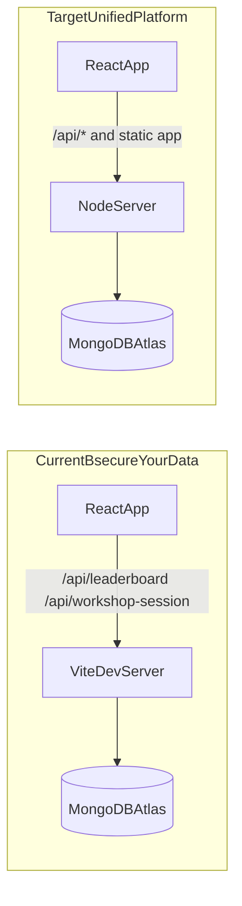

# Gamified MongoDB GameDay Workshop — Unified Improvement Plan

## Project identification

- **Project A (MongoDB Heist):** [mongodb-mayhem-master](/Users/pierre.petersson/labs-work/clean/mongodb-mayhem-master) — Heist-themed missions, Monaco editor, regex validation, XP/ranks/combos/chaos, mission map, HUD, boot sequence; client-only, localStorage, no workshop/session.
- **Project B (Workshop Framework):** [secure-your-data](/Users/pierre.petersson/labs-work/clean/secure-your-data) — Workshop sessions, templates, moderator PIN, session-scoped leaderboard, server-side verification (mongosh/AWS via Vite middleware), Atlas-backed leaderboard and workshop_sessions; no Heist UI, no real-time monitoring.

**Recommendations:**

- **Unified codebase:** secure-your-data. Port Heist gamification and UX from mongodb-mayhem-master; keep B's workshop and verification.
- **Backend:** MongoDB Atlas only. Same DB `workshop_framework`, collections: `workshop_sessions`, `leaderboard`, `points`, diagnostics.
- **API layer:** Use a **Node server** (Express or Fastify) for all API routes instead of Vite dev server middleware — so the same app runs in dev (Vite dev + Node API) and in production/Docker (Node serves built static + API). See "API: Vite vs Node" below.
- **Labs:** Use **Project B's labs only**. They have real server-side verification (mongosh/AWS) and are the right content for GameDay. Do not port A's regex-only missions as a second lab system; add Heist theming and gamification (XP, mission map, chaos, boot) on top of B's existing quests/labs.
- **Look and feel:** The unified app **must** match **mongodb-mayhem-master** (Heist) visually and experientially. See the dedicated section below; this is a hard requirement, not optional.

---

## Look and feel: align with mongodb-mayhem-master (Heist)

**Requirement:** The final workshop platform must look and feel like the Heist app in [mongodb-mayhem-master](/Users/pierre.petersson/labs-work/clean/mongodb-mayhem-master). All new or ported UI (dashboard, lab runner, leaderboard, moderator views) must use the same theme, typography, and visual language. Do not keep secure-your-data’s current generic UI when it conflicts with Heist.

**Reference implementation:** mongodb-mayhem-master (Project A).

### Theme and colors

- **Palette:** Dark green/teal “terminal” theme. Background very dark (e.g. `hsl(160 100% 4%)`), primary green `#00ED64` (hsl 145 95% 46%), accent purple (hsl 263 70% 58%), destructive red, warning orange. Use the same CSS variables as in [mongodb-mayhem-master/src/index.css](mongodb-mayhem-master/src/index.css) (`:root` and `.dark`) so cards, borders, and glows match.
- **Tier colors (mission map / quests):** Recon = primary green; Infiltration = warning orange; Exfiltration = destructive red (see [MissionNodeGraph.tsx](mongodb-mayhem-master/src/components/MissionNodeGraph.tsx) `TIER_META`).

### Typography

- **Fonts:** JetBrains Mono (mono/code/terminal), Inter (body). Import and use as in [mongodb-mayhem-master/src/index.css](mongodb-mayhem-master/src/index.css). Apply `font-mono` / `font-body` (or equivalent) consistently.

### Visual effects and CSS

- **Utilities to port or replicate:** `text-glow`, `text-glow-accent`, `border-glow`, `border-glow-accent`, `scanline`, `circuit-pattern` (from [mongodb-mayhem-master/src/index.css](mongodb-mayhem-master/src/index.css)). Use on landing, dashboard, and mission/lab views where Heist uses them.
- **Animations:** glitch, typing, blink-caret, pulse-border, float, counter-tick, slide-up, matrix-fall. Preserve or reimplement in the unified app for boot sequence, HUD, and mission map.
- **Monaco/editor hints:** If code editing is shown, use the same hint styling as Heist: `blank-marker-highlight`, `revealed-answer-green`, `hint-answer-inline` (green #00ED64, dashed underlines, amber for blanks).

### Key UI components to port (and keep the look)

- **Boot sequence** — [BootSequence](mongodb-mayhem-master/src/components/BootSequence.tsx): terminal-style boot animation; required for first-time or optional “Heist mode” entry.
- **Landing** — [Landing](mongodb-mayhem-master/src/pages/Landing.tsx): MatrixRain background, circuit-pattern, scanline, ASCII “MongoDB Data Heist” logo, typewriter, handle input. Replicate the same atmosphere for workshop entry (e.g. “Join workshop” or “Start”).
- **HUD bar** — [HUDBar](mongodb-mayhem-master/src/components/HUDBar.tsx): XP, rank, progress to next rank, combo/streak, optional mission timer, mute. Always visible during labs/quests where gamification is on.
- **Mission map** — [MissionNodeGraph](mongodb-mayhem-master/src/components/MissionNodeGraph.tsx): SVG graph, tier sections (Recon / Infiltration / Exfiltration), node glow, connections. Drive from B’s quests/labs; keep the same layout and styling.
- **Chaos overlay** — [ChaosEventOverlay](mongodb-mayhem-master/src/components/ChaosEventOverlay.tsx): full-screen disruption, countdown, penalty messaging. Use when chaos events are enabled for a lab/quest.
- **Cards and lists** — Mission cards, dashboard layout, and list styling (e.g. [MissionCard](mongodb-mayhem-master/src/components/MissionCard.tsx), [Dashboard](mongodb-mayhem-master/src/pages/Dashboard.tsx)): dark cards, primary-border glow, same spacing and hierarchy.

### Sound and polish

- **Sound engine:** [sound-engine](mongodb-mayhem-master/src/lib/sound-engine.ts): validate, success, error, etc. Port and use for step completion, flag capture, and critical actions so feedback matches Heist.
- **Optional:** MatrixRain on landing or idle screens; ActivityTicker for “recent activity” if it fits the workshop flow.

### What to avoid

- Do not keep a light or neutral theme as the default; Heist is dark-first.
- Do not drop the boot sequence, HUD, or mission map in favor of a plain list/dashboard.
- Do not use a different primary color or font set for the main workshop flow; consistency with Heist is required.

---

## API: Vite dev server vs Node server (recommendation)

**Recommendation: use a Node server for the API.**

| Aspect                 | Vite dev server only                                                                                           | Node server (recommended)                                                                                             |
| ---------------------- | -------------------------------------------------------------------------------------------------------------- | --------------------------------------------------------------------------------------------------------------------- |
| **Dev**                | All API in `vite.config.ts`; works today                                                                       | Vite dev (port 5173) proxies `/api/`* to Node (e.g. port 3000); same API code as prod                                 |
| **Production**         | No production API — you must run a separate Node app that reimplements or imports the same logic               | Node serves `dist/` (from `vite build`) and handles `/api/`*; one process, one deployment                             |
| **Docker**             | Would need two containers (Vite build + some server) or a custom server that runs Vite in dev mode (not ideal) | One container: build with `vite build`, run `node server.js`; server serves static from `dist/` and mounts API routes |
| **Central deployment** | Same problem: no single artifact that is both SPA and API                                                      | One Node app; set `MONGODB_URI` (Atlas); deploy to Railway, Render, Fly.io, ECS, etc.                                 |

**Implementation approach:** Extract the API logic from [vite.config.ts](secure-your-data/vite.config.ts) (leaderboard, workshop-session, verify-*, run-*, pty WebSocket, etc.) into a small Node app (e.g. `server/` or `api/` with Express/Fastify). In development, run `vite dev` and configure proxy: `server.proxy: { '/api': 'http://localhost:3000' }` so the frontend still calls `/api/...`. In production and Docker, run only the Node server: it serves the built SPA from `dist/` and the same API routes. MongoDB Atlas connection lives in the Node server (env `MONGODB_URI`).

---

## Labs: use Project B only (recommendation)

**Recommendation: keep Project B's labs as the only lab system; do not add Project A's missions as a second kind of lab.**

- **Project B's labs** ([content/topics](secure-your-data/src/content/topics), [content/quests](secure-your-data/src/content/quests), [verificationService](secure-your-data/src/services/verificationService.ts)): Real steps, real verification (mongosh, AWS CLI), templates and quests. This is what you need for a credible GameDay workshop.
- **Project A's missions** (mongodb-mayhem-master): Code snippets in Monaco, regex-only validation, no real execution. Thematically strong but not a replacement for real labs.

**Unified model:** One content model — B's quests and labs. Add Heist on top:

- **Quests** = "missions" in the narrative; optional tiers (e.g. Recon / Infiltration / Exfiltration) as metadata on quests or template.
- **Mission map** (ported from A) shows B's quests/labs as nodes, with completion from leaderboard.
- **Gamification** (XP, ranks, combo, chaos, boot sequence) runs during B's existing lab/step flow; no duplicate "Heist missions" with regex checks.

If you later want short "warm-up" challenges with no Atlas (regex or simple checks), you can add a separate "Challenge mode" that uses A-style snippets and regex — but the main workshop path should be B's labs only.

---

## 1. Feature inventory comparison

| Feature                                    | MongoDB Heist (A)                                                                                                                                                                                                                                                        | Workshop Framework (B)                                                                                                                                                                                                             | Gap/Opportunity                                                                                                       |
| ------------------------------------------ | ------------------------------------------------------------------------------------------------------------------------------------------------------------------------------------------------------------------------------------------------------------------------ | ---------------------------------------------------------------------------------------------------------------------------------------------------------------------------------------------------------------------------------- | --------------------------------------------------------------------------------------------------------------------- |
| **Mission/Challenge system**               | Missions in `game-data.ts` + prerequisites in `mission-prerequisites.ts`; tiered (Recon/Infiltration/Exfiltration)                                                                                                                                                       | Quests in `content/quests/`, labs in topics, flags; templates in `workshop-templates/`                                                                                                                                             | B has template/session binding; A has stronger narrative tiers. Unify: quests + tiers + template-driven mission sets. |
| **Code execution**                         | None (client-only)                                                                                                                                                                                                                                                       | Server-side via `/api/run-mongosh`, `/api/run-bash`, etc. in [vite.config.ts](secure-your-data/vite.config.ts)                                                                                                                     | Port B’s execution pipeline; optional sandbox for Heist-style “run and validate”.                                     |
| **Validation engine**                      | Regex in [validation.ts](mongodb-mayhem-master/src/lib/validation.ts) + [mission-validations.ts](mongodb-mayhem-master/src/lib/mission-validations.ts)                                                                                                                   | Server-side: [verificationService.ts](secure-your-data/src/services/verificationService.ts) + [validatorUtils.ts](secure-your-data/src/utils/validatorUtils.ts) calling `/api/verify-`* (mongosh/AWS)                              | B is superior (real checks). Keep B; add optional regex “quick check” for Heist missions if needed.                   |
| **User authentication**                    | Handle only ([Landing.tsx](mongodb-mayhem-master/src/pages/Landing.tsx)); no credentials                                                                                                                                                                                 | PIN-based moderator ([PresenterLogin](secure-your-data/src/components/PresenterLogin.tsx), [RoleContext](secure-your-data/src/contexts/RoleContext.tsx)); attendee = name/email in localStorage                                    | Keep PIN + email/name for MVP; optional later: MongoDB-backed users or OAuth.                                         |
| **Session/Workshop management**            | None                                                                                                                                                                                                                                                                     | [WorkshopSessionContext](secure-your-data/src/contexts/WorkshopSessionContext.tsx), [workshopUtils](secure-your-data/src/utils/workshopUtils.ts), `/api/workshop-session` (GET/POST/DELETE), sessions in Atlas `workshop_sessions` | B has it. Add PIN-protected join, session list by org/domain; keep Atlas.                                             |
| **Multi-tenancy**                          | None                                                                                                                                                                                                                                                                     | Session-scoped leaderboard (`sessionId`); `emailDomain` on session; no org/tenant table                                                                                                                                            | Add optional `organizationId`/`tenantId` on sessions; filter by tenant in Node API.                                   |
| **Instructor/Admin dashboard**             | None                                                                                                                                                                                                                                                                     | Moderator view: template picker, session create/select, leaderboard per session ([WorkshopSettings](secure-your-data/src/components/settings/WorkshopSettings.tsx))                                                                | B has basics. Add dedicated admin UI: create session, set PIN, assign template, view sessions.                        |
| **Real-time progress monitoring**          | None                                                                                                                                                                                                                                                                     | None (leaderboard fetched on demand)                                                                                                                                                                                               | Phase 3: polling or MongoDB Change Streams for live attendee progress.                                                |
| **Leaderboard/Scoring**                    | Mock + current user in [Leaderboard](mongodb-mayhem-master/src/pages/Leaderboard.tsx); XP in [game-store](mongodb-mayhem-master/src/lib/game-store.ts)                                                                                                                   | [leaderboardUtils](secure-your-data/src/utils/leaderboardUtils.ts) + [leaderboardApi](secure-your-data/src/services/leaderboardApi.ts); per-session; Atlas `leaderboard`, `points`                                                 | B is session-aware. Unify with Heist XP/ranks; keep storing in Atlas (extend schema if needed).                       |
| **Team/Collaboration**                     | None                                                                                                                                                                                                                                                                     | None (`WorkshopTeam` type exists in [types](secure-your-data/src/types/index.ts) but unused)                                                                                                                                       | Phase 3: team IDs, team leaderboard.                                                                                  |
| **Analytics/Reporting**                    | None                                                                                                                                                                                                                                                                     | None (only content tags “analytics”)                                                                                                                                                                                               | Phase 3: post-workshop export, completion rates, time-per-lab.                                                        |
| **Gamification (XP, Ranks, Achievements)** | Full: XP, ranks (Script Kiddie → Zero Day Architect), combo streak ([ComboStreak](mongodb-mayhem-master/src/components/ComboStreak.tsx)), achievements, chaos events ([ChaosEventOverlay](mongodb-mayhem-master/src/components/ChaosEventOverlay.tsx)), difficulty modes | Points, leaderboard order; [gamificationService](secure-your-data/src/services/gamificationService.ts) has points and achievement types but no unlock logic; no combos/chaos                                                       | A is far ahead. Port Heist gamification into B’s workshop flow.                                                       |
| **Database backend**                       | localStorage only (`mongodb-heist-player`)                                                                                                                                                                                                                               | Vite dev server middleware → MongoDB Atlas (`workshop_framework`: `leaderboard`, `points`, `workshop_sessions`)                                                                                                                    | Keep MongoDB Atlas; move API from Vite to Node server.                                                                |
| **API layer**                              | None                                                                                                                                                                                                                                                                     | All in [vite.config.ts](secure-your-data/vite.config.ts) `configureServer`: `/api/leaderboard`, `/api/workshop-session`, `/api/verify-`*, `/api/run-`*, `/api/pty`, etc.                                                           | Extract to Node server (Express/Fastify); same code for dev (Vite proxies) and prod/Docker.                           |
| **Deployment/Infrastructure**              | Static SPA (Vite build)                                                                                                                                                                                                                                                  | Same + Atlas connection for dev server                                                                                                                                                                                             | Node server serves `dist/` + API; Docker Compose + central deploy with Atlas.                                         |

---

## 2. Architecture comparison

**Project B (secure-your-data) backend:** No standalone backend process. All “backend” is **Vite dev server middleware** in `vite.config.ts`: `getLeaderboardMongoClient()` connects to MongoDB Atlas; routes serve leaderboard, workshop_sessions, verify-*, run-mongosh/run-bash, PTY WebSocket. For production and Docker, move this to a Node server; Atlas remains the database.

**Authentication:** B: moderator = PIN (env/localStorage); attendee = name/email only. A: handle only. Keep PIN + email/name for MVP; optional later: MongoDB-backed users or OAuth.

**Workshop sessions (B):** Sessions stored in Atlas `workshop_sessions`; client GET/POST/DELETE via `/api/workshop-session`. Current session id in localStorage; leaderboard keyed by `sessionId`. No PIN on session; no org/tenant.

**Database (B):** MongoDB Atlas, DB `workshop_framework`, collections: `leaderboard`, `points`, `workshop_sessions`, diagnostics. Atlas is the only app database.

**Validation (B):** Server-side only. `VerificationService.verify(id, ctx)` → `validatorUtils` → fetch `/api/verify-`* or `/api/check-mongo-connection`; Vite middleware runs mongosh scripts or AWS CLI and returns success/failure. No regex; no client-side execution.

**Real-time (B):** None. Leaderboard and session list are on-demand fetch; no WebSockets/SSE/polling for live progress.

---

## 3. What Project B does better

| Item                        | Location / approach                                                                                                                                                                                  | Why better                                            | Port difficulty                                       |
| --------------------------- | ---------------------------------------------------------------------------------------------------------------------------------------------------------------------------------------------------- | ----------------------------------------------------- | ----------------------------------------------------- |
| Session-scoped leaderboard  | [leaderboardUtils](secure-your-data/src/utils/leaderboardUtils.ts), [vite.config.ts](secure-your-data/vite.config.ts) leaderboard + workshop_sessions                                                | Multi-session isolation, moderator can switch session | Small: keep in Atlas; API moves to Node               |
| Workshop session CRUD       | `/api/workshop-session`, [workshopUtils](secure-your-data/src/utils/workshopUtils.ts)                                                                                                                | Create/list/delete sessions; Atlas as source of truth | Small: keep Atlas; serve from Node API                |
| Server-side verification    | [verificationService](secure-your-data/src/services/verificationService.ts) + [validatorUtils](secure-your-data/src/utils/validatorUtils.ts) + vite `configureServer`                                | Real mongosh/AWS checks instead of regex              | Medium: move verify/run handlers into Node server     |
| Moderator vs attendee roles | [RoleContext](secure-your-data/src/contexts/RoleContext.tsx), [PresenterLogin](secure-your-data/src/components/PresenterLogin.tsx)                                                                   | Clear role separation, PIN gate for moderator         | Small: keep pattern                                   |
| Template + instance model   | [WorkshopTemplate](secure-your-data/src/types/index.ts), [WorkshopInstance](secure-your-data/src/types/index.ts), [WorkshopSessionContext](secure-your-data/src/contexts/WorkshopSessionContext.tsx) | Reusable templates, instance = running workshop       | Small: already persisted via Atlas workshop_sessions  |
| Lab/quest/content model     | [contentService](secure-your-data/src/services/contentService.ts), quests, flags, labs, enhancements                                                                                                 | Structured content with verificationId and steps      | Small: already in B; Heist gamification layers on top |

---

## 4. What Project A does better

| Item                | Location                                                                                                                                                                                                                                                                    | Why better                                                                                           |
| ------------------- | --------------------------------------------------------------------------------------------------------------------------------------------------------------------------------------------------------------------------------------------------------------------------- | ---------------------------------------------------------------------------------------------------- |
| Gamification depth  | [game-store](mongodb-mayhem-master/src/lib/game-store.ts), [game-data](mongodb-mayhem-master/src/lib/game-data.ts) (RANK_THRESHOLDS, chaos), [ComboStreak](mongodb-mayhem-master/src/components/ComboStreak.tsx), [HUDBar](mongodb-mayhem-master/src/components/HUDBar.tsx) | XP, ranks, level, achievements, combo streak, chaos events; B has only points and leaderboard order. |
| Visual mission map  | [MissionNodeGraph](mongodb-mayhem-master/src/components/MissionNodeGraph.tsx)                                                                                                                                                                                               | SVG tiered graph, search-to-node, animated connections; B has no equivalent.                         |
| Themed onboarding   | [BootSequence](mongodb-mayhem-master/src/components/BootSequence.tsx)                                                                                                                                                                                                       | Terminal-style boot; B has no boot.                                                                  |
| Chaos events        | [ChaosEventOverlay](mongodb-mayhem-master/src/components/ChaosEventOverlay.tsx), chaos in mission definitions                                                                                                                                                               | Timed in-mission disruptions; B has none.                                                            |
| Difficulty modes    | [DifficultySelector](mongodb-mayhem-master/src/components/DifficultySelector.tsx), skeletons per difficulty in [mission-skeletons](mongodb-mayhem-master/src/lib/mission-skeletons.ts)                                                                                      | Guided/Challenge/Expert with different hints/skeletons; B has lab difficulty but not per-step modes. |
| In-editor hints     | [InlineHintMarker](mongodb-mayhem-master/src/components/InlineHintMarker.tsx), hints in mission-skeletons                                                                                                                                                                   | Structured hints with XP penalty; B has hints in steps but less integrated.                          |
| Mission timer + HUD | [MissionPage](mongodb-mayhem-master/src/pages/MissionPage.tsx), [HUDBar](mongodb-mayhem-master/src/components/HUDBar.tsx)                                                                                                                                                   | Per-mission timer, live XP/rank/streak in HUD.                                                       |

---

## 5. Top 5 integration opportunities (from B into A/unified platform)

Ranked by impact on workshop delivery, feasibility, and alignment with multi-tenant corporate workshops:

1. **Session/workshop management and session-scoped data (B)** — Impact: high. Enables multiple simultaneous workshops and isolated leaderboards. Effort: keep Atlas `workshop_sessions`; serve via Node API; keep WorkshopSessionContext and workshopUtils semantics.
2. **Moderator role + PIN and template/instance model (B)** — Impact: high. Instructors can create sessions, assign templates, and view per-session leaderboard. Effort: retain RoleContext + PresenterLogin; add optional PIN-per-session in Atlas (e.g. `pinHash` on workshop_sessions).
3. **Server-side verification pipeline (B)** — Impact: high. Real mongosh/AWS checks instead of regex. Effort: medium — move verify/run handlers from vite.config.ts into Node server; keep VerificationService + validatorUtils interface.
4. **Real-time progress monitoring (new, inspired by B’s data model)** — Impact: medium. Instructors see live completion and scores. Effort: medium — polling (e.g. every 5–10s) or MongoDB Change Streams on leaderboard/points; moderator UI shows live table.
5. **Configurable prerequisites and template-driven mission sets (B)** — Impact: medium. Templates already define `labIds`/`questIds`; add per-session overrides and prerequisite rules in DB for unlock chains. Effort: medium — schema + UI for “mission set” per session.

---

## 6. Phased implementation plan

### Phase 1 — Foundation (must-have for MVP workshop)

- **Node server for API (extract from Vite)**
  - **Source:** Port from B (logic in [vite.config.ts](secure-your-data/vite.config.ts) configureServer).
  - **Effort:** Medium (3–5 days).
  - **Dependencies:** None.
  - **Approach:** Create Node app (Express or Fastify) in `server/` with all `/api/`* routes (leaderboard, workshop-session, verify-*, run-*, PTY). Use Atlas (env MONGODB_URI). Dev: Node on 3000, Vite proxy /api to Node.
- **MongoDB Atlas schema (keep and extend)**
  - **Source:** Keep existing B usage; extend if needed.
  - **Effort:** Small (0.5–1 day).
  - **Dependencies:** None.
  - **Approach:** Keep DB `workshop_framework`, collections: `workshop_sessions`, `leaderboard`, `points`, diagnostics. Add optional: `workshop_sessions.pinHash`, `workshop_sessions.organizationId` for multi-tenant filtering.
- **Workshop session API (served by Node)**
  - **Source:** Same as today; served by Node instead of Vite.
  - **Effort:** Part of Node server work.
  - **Dependencies:** Node server, Atlas.
  - **Approach:** Node routes GET/POST/DELETE `/api/workshop-session`; read/write Atlas `workshop_sessions`. Client keeps [workshopUtils](secure-your-data/src/utils/workshopUtils.ts) unchanged.
- **Leaderboard API (served by Node)**
  - **Source:** Same as today; served by Node.
  - **Effort:** Part of Node server work.
  - **Dependencies:** Node server, Atlas.
  - **Approach:** Node routes for `/api/leaderboard` and related; read/write Atlas `leaderboard` and `points`. Client unchanged.
- **PIN-protected session join (optional but recommended)**
  - **Source:** New build.
  - **Effort:** Small (1 day).
  - **Dependencies:** Session table (e.g. `pin_hash` or `join_code`).
  - **Approach:** On session create, moderator sets 6-digit PIN or code; store hash in `workshop_sessions`. Attendee “Join workshop” flow: enter session ID/code + PIN; verify then set current session in context/localStorage.
- **Multi-tenant isolation (optional)**
  - **Source:** New build.
  - **Effort:** Small (1 day).
  - **Dependencies:** `workshop_sessions.organizationId` in Atlas.
  - **Approach:** Add optional `organizationId` to sessions; Node API filters session list by org (e.g. moderator sees only their org).
- **Docker Compose and central deployment**
  - **Source:** New build.
  - **Effort:** Small (1–2 days).
  - **Dependencies:** Node server that serves API + static.
  - **Approach:** Dockerfile: build stage `vite build`; production stage Node serves `dist/` and `/api`. Env: `MONGODB_URI`. docker-compose.yml: one service `app`, port 3000 (or 80). Optional `mongo` service for local dev without Atlas. Central deploy: same image to Railway/Render/Fly.io/ECS; set `MONGODB_URI` to Atlas.

Phase 1 deliverables: One codebase; dev = Vite dev + Node API (proxy); prod/Docker = Node serves `dist/` + API; all persistence in MongoDB Atlas. Instructors create/select sessions (optional PIN), attendees join and get session-scoped leaderboard. Run locally with `docker compose up` or deploy centrally with the same image.

---

### Phase 2 — Enhancement (better workshop experience)

**Look and feel:** All Phase 2 UI work must follow the [Look and feel: mongodb-mayhem-master (Heist)](#look-and-feel-align-with-mongodb-mayhem-master-heist) section (theme, fonts, components, animations). Port or adapt components from mongodb-mayhem-master so the workshop experience is visually and experientially Heist.

- **Port Heist gamification into secure-your-data**
  - **Source:** Port from A (mongodb-mayhem-master).
  - **Effort:** Medium (3–5 days).
  - **Dependencies:** Phase 1 (scores in Atlas).
  - **Approach:** Add XP, level, ranks (from [game-data](mongodb-mayhem-master/src/lib/game-data.ts) RANK_THRESHOLDS) and store in `leaderboard` or a `player_progress` table; port [ComboStreak](mongodb-mayhem-master/src/components/ComboStreak.tsx) and [HUDBar](mongodb-mayhem-master/src/components/HUDBar.tsx); fire events from existing [gamificationService](secure-your-data/src/services/gamificationService.ts) (step_completed, flag_captured, quest_completed) to update combo and XP.
- **Mission map (quest/lab graph)**
  - **Source:** Port from A ([MissionNodeGraph](mongodb-mayhem-master/src/components/MissionNodeGraph.tsx)).
  - **Effort:** Medium (3–5 days).
  - **Dependencies:** Quest/lab model in B.
  - **Approach:** Map B’s quests and labs to nodes; tiers from quest metadata or template. Reuse SVG layout and search-to-node; drive from `activeTemplate` + `workshopInstance` and completion from leaderboard/player progress.
- **Boot sequence and themed onboarding**
  - **Source:** Port from A ([BootSequence](mongodb-mayhem-master/src/components/BootSequence.tsx)).
  - **Effort:** Small (1–2 days).
  - **Dependencies:** None.
  - **Approach:** Add optional “Heist” onboarding route; skip after first completion (localStorage or user preference).
- **Chaos events and difficulty modes**
  - **Source:** Port from A (chaos in [game-data](mongodb-mayhem-master/src/lib/game-data.ts), [ChaosEventOverlay](mongodb-mayhem-master/src/components/ChaosEventOverlay.tsx), [DifficultySelector](mongodb-mayhem-master/src/components/DifficultySelector.tsx)).
  - **Effort:** Medium (3–5 days).
  - **Dependencies:** Lab/quest runner in B.
  - **Approach:** Add optional chaos config to lab/quest or template; timer and overlay in [LabRunner](secure-your-data/src/labs/LabRunner.tsx) or step view. Difficulty: add mode to template/session and map to step variants (e.g. hints on/off, skeleton level).
- **Verification/run pipeline (Node server)**
  - **Source:** Port from B (vite.config.ts verify + run routes).
  - **Effort:** Medium (3–5 days, if not fully done in Phase 1).
  - **Dependencies:** Phase 1 Node API extraction.
  - **Approach:** Keep the same endpoint contract (`/api/verify-`*, `/api/run-`*) and move handlers into Node. Node executes mongosh/AWS CLI and returns structured results.

Phase 2 deliverables: Workshop experience includes Heist-style XP, ranks, combo, mission map, optional boot and chaos; verification and execution run via the Node API.

---

### Phase 3 — Advanced (competitive advantage)

- **Real-time progress monitoring for instructors**
  - **Source:** New build using B’s data model.
  - **Effort:** Medium (3–5 days).
  - **Dependencies:** Phase 1 leaderboard in Atlas.
  - **Approach:** Polling every 5–10s for current session leaderboard/points; optional MongoDB Change Streams for lower-latency updates.
- **Configurable prerequisites per session**
  - **Source:** Hybrid (B has templates; A has hardcoded prerequisites).
  - **Effort:** Medium (3–5 days).
  - **Dependencies:** Phase 1 sessions, Phase 2 quest/lab model.
  - **Approach:** Add `prerequisite_rules` or `unlock_rules` to template or session (e.g. “lab B unlocks after lab A”); enforce in UI and optionally in API when recording completion.
- **Post-workshop analytics/reporting**
  - **Source:** New build.
  - **Effort:** Medium (3–5 days).
  - **Dependencies:** Phase 1 schema (sessions, leaderboard, points).
  - **Approach:** Export CSV/JSON per session (completion rates, time per lab, score distribution); simple report page for moderators (and optional scheduled email).
- **Team/collaboration**
  - **Source:** New build (B has [WorkshopTeam](secure-your-data/src/types/index.ts) type).
  - **Effort:** Large (1–2 weeks).
  - **Dependencies:** Phase 1.
  - **Approach:** Add `workshop_teams` collection (or embed teams under workshop session docs); link users to team per session; aggregate scores by team; team leaderboard view.
- **Achievement system**
  - **Source:** Port from A (achievements in [game-store](mongodb-mayhem-master/src/lib/game-store.ts)) + extend.
  - **Effort:** Small–medium (2–3 days).
  - **Dependencies:** Phase 2 gamification.
  - **Approach:** Define achievements in content or Atlas; gamificationService unlocks when conditions are met; store in `player_progress` (collection or embedded); show in profile and HUD.

---

## 7. Diagram: current vs target data flow

---

## 8. Summary

- **Unified codebase:** secure-your-data, with Heist gamification and UX ported from mongodb-mayhem-master.
- **Look and feel:** Must match mongodb-mayhem-master (Heist): dark green/terminal theme, JetBrains Mono + Inter, same CSS variables and effects (glow, scanline, circuit-pattern), BootSequence, HUDBar, MissionNodeGraph, ChaosEventOverlay, sound engine. No generic/light theme as default.
- **Phase 1:** Node API extraction + Atlas-first persistence (sessions, leaderboard, points), session-scoped isolation, optional PIN and tenant, Docker Compose + central deployment.
- **Phase 2:** Heist gamification (XP, ranks, combos) and Heist UI (mission map, boot sequence, HUD, chaos) ported; all styling per Heist. Verification/run in the Node API.
- **Phase 3:** Real-time monitoring, configurable prerequisites, analytics export, teams, achievements.

All items assume React 18 + Vite + TypeScript + Tailwind + shadcn/ui; backend and persistence stay MongoDB Atlas + Node while preserving B’s workshop flows and A’s gamification and full look-and-feel (Heist).