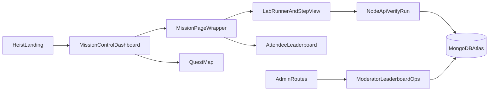

# Heist Workflow Alignment Plan

## Current state assessment

### Heist app workflow (reference)

- Route-driven experience: Landing, Dashboard, MissionPage, Profile, Leaderboard, Quests.
- User flow is cinematic and linear: `Landing -> Dashboard -> MissionPage -> completion -> Dashboard/Leaderboard`.
- Global chrome is consistent across pages (`HUDBar`, Matrix background, mission vocabulary).

```23:29:/Users/pierre.petersson/labs-work/clean/mongodb-mayhem-master/src/App.tsx
<Route path="/" element={<Landing />} />
<Route path="/dashboard" element={<Dashboard />} />
<Route path="/mission/:missionId" element={<MissionPage />} />
<Route path="/profile" element={<Profile />} />
<Route path="/leaderboard" element={<Leaderboard />} />
<Route path="/quests" element={<Quests />} />
```

```153:156:/Users/pierre.petersson/labs-work/clean/mongodb-mayhem-master/src/pages/Dashboard.tsx
<MatrixRain />
<HUDBar player={player} />
```

### secure-your-data workflow (current)

- Router is still minimal (`/` and `/leaderboard`), with most navigation done by in-page `Section` switches.
- User flow is mixed: Heist entry exists, but then workshop-era setup/sidebar/lab-hub structure dominates.
- There is a legacy section model (`lab1/lab2/lab3`) and workshop framing (“Presentation”, “Lab Setup”, “Metrics”).

```38:41:/Users/pierre.petersson/labs-work/clean/secure-your-data/src/App.tsx
<Route path="/" element={<Index />} />
<Route path="/leaderboard" element={<Index />} />
<Route path="*" element={<NotFound />} />
```

```75:89:/Users/pierre.petersson/labs-work/clean/secure-your-data/src/types/index.ts
export type Section =
  | 'presentation'
  | 'setup'
  | 'lab'
  | 'lab1'
  | 'lab2'
  | 'lab3'
  | 'cheatsheet'
  | 'leaderboard'
  | 'settings'
  | 'challenge'
  | 'metrics';
```

```54:73:/Users/pierre.petersson/labs-work/clean/secure-your-data/src/components/layout/AppSidebar.tsx
const navItems: NavItem[] = [
  { id: 'presentation', label: 'Presentation', ... },
  { id: 'setup', label: 'Lab Setup', ... },
  { id: 'lab', label: 'Labs', ... },
  ...
];
```

### What has already been merged (strong)

- Heist-style entry and atmosphere (`HeistLanding`, Matrix/typewriter).
- Boot sequence and HUD integration in lab flows.
- Difficulty selector and tier behavior in lab tabs.
- Achievement model and team leaderboard scaffolding added recently.

```15:20:/Users/pierre.petersson/labs-work/clean/secure-your-data/src/pages/Index.tsx
import { BootSequence } from '@/components/workshop/BootSequence';
import { HeistLanding } from '@/components/workshop/HeistLanding';
```

```384:391:/Users/pierre.petersson/labs-work/clean/secure-your-data/src/components/labs/LabViewWithTabs.tsx
<p className="text-xs font-mono text-muted-foreground mb-2">DIFFICULTY</p>
<DifficultySelector
  selected={difficulty}
  onChange={setDifficulty}
  hintCounts={hintCounts}
/>
```

## Page-by-page gap analysis and target behavior

## 1) Entry/Landing

- Current: Heist visual style exists and works well.
- Gap: Unlike Heist app, participant identity creation is still detached (goes into attendee registration + workshop setup flow).
- Target: Keep current HeistLanding visuals but make it lead directly into mission-style onboarding with less enterprise form feel.

## 2) Global navigation and shell

- Current: Sidebar-first workshop shell and section switching.
- Gap: Heist is top HUD + route-based mission-control pages; secure-your-data still feels like admin/workshop app.
- Target: Introduce Heist shell mode as default for attendees: top HUD, mission tabs, route-level pages; keep moderator tools behind dedicated admin entry.

## 3) Dashboard

- Current: No true Heist-equivalent main dashboard page route; primary “home” is section-based and can land in setup/lab hub.
- Gap: Heist “Mission Control” (map/grid/search/sidebar stats) is the core page.
- Target: Build a dedicated dashboard route/page in secure-your-data that mirrors Heist structure but uses real workshop labs/quests data.

## 4) Mission/Lab execution page

- Current: `LabRunner -> LabViewWithTabs -> StepView` is strong and feature-rich, but ergonomics are still workshop/IDE-oriented.
- Gap: Heist has focused mission phases (`briefing -> active -> complete/failed`) and tighter emotional flow.
- Target: Wrap existing real verification lab engine in mission-phase shell to preserve backend correctness while matching Heist behavior.

## 5) Leaderboard

- Current: Functional and more enterprise-capable (session filters, delete/reset tools, CSV export, team mode).
- Gap: Heist leaderboard is cleaner and identity-driven; participant experience should not be crowded by moderator controls.
- Target: Split attendee leaderboard UI from moderator operations UI.

## 6) Quests/Challenge mode

- Current: Quest map and challenge mode exist; still coexists with old “labs list + setup + section” patterns.
- Gap: Heist quest progression should be primary navigation, not side mode.
- Target: Make quest/mission map the main way to choose and progress labs for attendees.

## 7) Legacy lab format (`lab1/lab2/lab3`)

- Current: Still present in type system and section handling.
- Applicability: Useful only for backward compatibility and migration.
- Target: Keep as compatibility fallback behind feature flag; remove from attendee-visible nav and primary flow.

## Execution phases (ordered)

## Phase A: Routing and shell unification (highest impact)

- Add route-level pages in secure-your-data for attendee experience:
  - `/` landing/onboarding
  - `/dashboard` mission control
  - `/mission/:labId` mission runner wrapper
  - `/quests`
  - `/leaderboard`
- Keep moderator/admin tools in separate route group (`/admin/*`) or role-gated drawer.
- Eliminate section-switching as primary attendee navigation.

Key files:

- [/Users/pierre.petersson/labs-work/clean/secure-your-data/src/App.tsx](/Users/pierre.petersson/labs-work/clean/secure-your-data/src/App.tsx)
- [/Users/pierre.petersson/labs-work/clean/secure-your-data/src/pages/Index.tsx](/Users/pierre.petersson/labs-work/clean/secure-your-data/src/pages/Index.tsx)
- [/Users/pierre.petersson/labs-work/clean/secure-your-data/src/components/layout/AppSidebar.tsx](/Users/pierre.petersson/labs-work/clean/secure-your-data/src/components/layout/AppSidebar.tsx)

## Phase B: Dashboard parity with Heist

- Implement dedicated attendee dashboard using:
  - mission map + grid toggle
  - search/filter
  - active quests and progress cards
  - compact Heist-like right rail stats
- Map data from workshop templates/quests/labs instead of static Heist mission dataset.

Key files:

- [/Users/pierre.petersson/labs-work/clean/secure-your-data/src/components/workshop/MissionNodeGraph.tsx](/Users/pierre.petersson/labs-work/clean/secure-your-data/src/components/workshop/MissionNodeGraph.tsx)
- [/Users/pierre.petersson/labs-work/clean/secure-your-data/src/components/workshop/QuestMapView.tsx](/Users/pierre.petersson/labs-work/clean/secure-your-data/src/components/workshop/QuestMapView.tsx)
- new page: `src/pages/Dashboard.tsx`

## Phase C: Mission wrapper over real labs

- Add `MissionPage`-like wrapper around `LabRunner`:
  - Briefing panel
  - Mission start button
  - Active phase with timer/chaos/HUD
  - Completion screen with XP and CTA back to dashboard/leaderboard
- Reuse existing `LabViewWithTabs` and `StepView` for verification/run pipelines.

Key files:

- [/Users/pierre.petersson/labs-work/clean/secure-your-data/src/labs/LabRunner.tsx](/Users/pierre.petersson/labs-work/clean/secure-your-data/src/labs/LabRunner.tsx)
- [/Users/pierre.petersson/labs-work/clean/secure-your-data/src/components/labs/LabViewWithTabs.tsx](/Users/pierre.petersson/labs-work/clean/secure-your-data/src/components/labs/LabViewWithTabs.tsx)
- new page: `src/pages/MissionPage.tsx`

## Phase D: UX cleanup and legacy containment

- Remove attendee-visible legacy labels and entries:
  - hide `presentation/setup/metrics/lab1/lab2/lab3` from attendee menu
  - replace with Heist vocabulary (`Mission Control`, `Operations`, `Intel`, `Leaderboard`)
- Keep legacy paths for moderator and compatibility only.

Key files:

- [/Users/pierre.petersson/labs-work/clean/secure-your-data/src/types/index.ts](/Users/pierre.petersson/labs-work/clean/secure-your-data/src/types/index.ts)
- [/Users/pierre.petersson/labs-work/clean/secure-your-data/src/components/layout/AppSidebar.tsx](/Users/pierre.petersson/labs-work/clean/secure-your-data/src/components/layout/AppSidebar.tsx)

## Phase E: Leaderboard split (attendee vs moderator)

- Attendee route: clean Heist leaderboard only.
- Moderator route: current operational tools (session switch, cleanup/delete, exports, team admin).

Key files:

- [/Users/pierre.petersson/labs-work/clean/secure-your-data/src/components/labs/Leaderboard.tsx](/Users/pierre.petersson/labs-work/clean/secure-your-data/src/components/labs/Leaderboard.tsx)

## Test plan (how you validate behavior)

- Golden-path attendee:
  - Landing -> registration -> dashboard -> mission run -> completion -> leaderboard.
- UX parity checks against Heist:
  - Route structure parity
  - Navigation chrome parity
  - Dashboard composition parity
  - Mission lifecycle parity
- Functional checks (must keep secure-your-data strengths):
  - `/api/run-mongosh` and verify endpoints still succeed
  - Session-scoped leaderboard persists
  - Team and achievements update
  - Difficulty and hints/penalties behave as expected

## Old lab format decision

- `lab1/lab2/lab3` remains only as compatibility fallback for older templates/content.
- Not used in primary attendee workflow after Phase D.
- Add migration note + optional feature flag to fully disable legacy sections once all templates are migrated.

## Workflow architecture target




