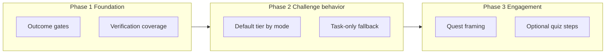

# Learning engagement beyond fill-in-the-blank

## 1. Critical analysis of the feedback

**Current model (what we have):**

- Steps are driven by **enhancement metadata**: `skeleton` (code with blanks like `_________`) + `inlineHints` (line, blankText, hint, answer).
- Optional tiers exist in schema and UI: `challengeSkeleton`, `expertSkeleton` — but **only CSFLE** uses them; all other labs use a single guided skeleton.
- **Verification** is optional: many steps have no `verificationId`; when present, "Check progress" runs `VerificationService` (real checks: key vault, encrypted fields, index usage, etc.).
- **Quest/Challenge mode**: same lab steps, with quest story and flags; skeleton tier is **user-selected** (default remains `guided`), not forced by mode.

**Why fill-in-the-blank fails as a teaching medium:**

- It rewards **pattern completion** (matching a blank to a hint) rather than **understanding** (why this API, what invariant this satisfies).
- With AI, the barrier collapses: "fill these blanks" is trivial for a model; the attendee may never read the narrative or think about the problem.
- There is no **stake** beyond "complete the step" — no consequence for pasting the solution, no reason to care about the outcome.

**Root cause:** Success is defined as "editor matches solution" (or "I clicked through"), not "I achieved an outcome and could explain it." Engagement is optional.

---

## 2. Alternative approaches (mitigations)

| Approach                                                | What changes                                                                                                                                                                                                                                                                                   | How it increases engagement                                                                                                                                                        | Trade-off / risk                                                                                                                                                            |
| ------------------------------------------------------- | ---------------------------------------------------------------------------------------------------------------------------------------------------------------------------------------------------------------------------------------------------------------------------------------------- | ---------------------------------------------------------------------------------------------------------------------------------------------------------------------------------- | --------------------------------------------------------------------------------------------------------------------------------------------------------------------------- |
| **A. Outcome-based gates**                              | Success = verification passes (data/state in DB, query result, index exists). De-emphasize or hide "correct code"; emphasize "Check progress" and narrative. Expand verification coverage so most steps have a real check.                                                                     | Attendees must produce *working* code (themselves or via AI); they still have to run it and fix failures. Shifts goal to "make it work" not "fill the blank."                      | Without other changes, attendees can still paste full solution and hit Run + Verify; engagement is "run something that works" not "understand."                             |
| **B. Challenge mode = task-only (minimal/no skeleton)** | In challenge mode, default to **task-only**: show instructions + success criteria + optional minimal stub (e.g. "// Connect to DB\n// Insert one document with field X\n"). No fill-in-blank; editor starts empty or with comments only. Rely on verification to gate progress.                | Forces "write or assemble" the solution; AI use becomes explicit (prompt + run + verify). Removes low-effort blank completion.                                                     | Beginners may struggle; need strong narrative, optional "reference" that doesn’t replace thinking, and possibly a "request hint" that adds structure without giving answer. |
| **C. Quests as primary engagement driver**              | Double down on **story** (breach, audit, migration), **stakes** (time, flags, leaderboard), and **outcome** (capture flag = verification passed). Labs become "missions"; completion = verification + optional flags. De-emphasize "complete the code" in UI; emphasize "achieve the mission." | People care when there’s a story and a visible goal (flag, leaderboard). Same content, different framing and default behavior (e.g. challenge tier or task-only in quest context). | Requires consistent verification and flag design; some labs need new verification IDs.                                                                                      |
| **D. Explain / reason steps**                           | Add steps that are **understanding checks**: e.g. "Why does this query use the index?" (multiple choice or short answer), "What would break if we removed this stage?" Use existing `exercises` (type: `quiz`) or new step type.                                                               | Tests comprehension, not just execution. Harder to outsource entirely to AI without reading.                                                                                       | Needs authoring and possibly review; can feel like an exam if overused.                                                                                                     |
| **E. Progressive disclosure by mode**                   | **Demo:** full solution, observe. **Lab:** guided skeleton + hints (current). **Challenge:** task-only or expert skeleton by default; verification required to advance; quest narrative.                                                                                                       | Clear progression; "challenge" is where we signal "we care that you can do it."                                                                                                    | Requires implementing mode-based default tier and more challenge/expert content or task-only fallback.                                                                      |
| **F. AI-use-aware design**                              | Assume attendees will use AI. Design so that **using AI still requires**: (1) reading the task and success criteria, (2) running and iterating until verification passes, (3) optional "explain in one sentence" or quiz. Strict outcome verification; no reward for blank-filling.            | Realistic; focuses on outcome + optional understanding. Reduces pretense that "no AI" is enforced.                                                                                 | Does not force deep understanding without D or similar.                                                                                                                     |

**Recommendation:** Combine **A + B + C + E** (outcome gates, challenge = task-only, quest-led framing, mode-based behavior). Use **D** selectively for high-value steps. Design with **F** in mind (assume AI; reward outcome and optional reasoning).

---

## 3. What actually needs to change (by component)

- **Content model** (`[src/labs/enhancements/schema.ts](src/labs/enhancements/schema.ts)`): Already has `challengeSkeleton`, `expertSkeleton`, `exercises`. Optional: add a **task-only** variant (e.g. `taskDescriptionOnly?: string` with no code block, or treat empty `challengeSkeleton` as "instructions + empty editor").
- **StepView / LabRunner** (`[src/components/labs/StepView.tsx](src/components/labs/StepView.tsx)`, `[src/labs/LabRunner.tsx](src/labs/LabRunner.tsx)`):  
  - **Default skeleton tier by mode:** When `currentMode === 'challenge'`, default `skeletonTier` to `'challenge'` (or `'expert'` if we want minimal). When `challengeSkeleton` is missing, fall back to minimal stub or instructions-only (no full skeleton).  
  - **Verification as gate:** Optionally require "Check progress" to pass before enabling "Next" in challenge mode (already possible; ensure UX is clear).
- **Quest / Challenge UX** (`[src/components/workshop/ChallengeModeView.tsx](src/components/workshop/ChallengeModeView.tsx)`, `[src/content/quests/stop-the-leak.ts](src/content/quests/stop-the-leak.ts)`): Strengthen narrative and surface "mission" and flags; ensure lab steps in quest context use challenge tier or task-only by default.
- **Verification coverage** (`[src/services/verificationService.ts](src/services/verificationService.ts)`, `[src/utils/validatorUtils.ts](src/utils/validatorUtils.ts)`): Add or expand verification for high-traffic labs so that challenge mode is outcome-gated, not "click through."
- **Content authoring** (ADD_LAB / enhancements): For new labs and key existing ones, add **challengeSkeleton** (task-only or minimal) and **verificationId** where feasible; optionally add **exercises** (quiz) for 1–2 steps per lab where "why" matters.

---

## 4. Implementation order and rationale

| Order | What                                                  | Why first                                                                                                                                                                                                                                                                          |
| ----- | ----------------------------------------------------- | ---------------------------------------------------------------------------------------------------------------------------------------------------------------------------------------------------------------------------------------------------------------------------------- |
| **1** | **Outcome-based gates (verification)**                | Without verification, "task-only" and "challenge default" don’t change behavior — attendees could still advance with no working code. Define success as "verification passes"; make "Check progress" prominent and, in challenge mode, required before Next.                       |
| **2** | **Expand verification coverage**                      | Add or implement verification for the most-used labs (e.g. CSFLE, QE, Rich Query, Timeseries) so that outcome gates are real. Prefer checks that validate state/result (e.g. collection exists, field encrypted, aggregation result shape) rather than "run and confirm manually." |
| **3** | **Default skeleton tier by mode**                     | In challenge mode, set initial `skeletonTier` to `'challenge'` (or `'expert'`) so the UI shows challenge/expert skeleton when available. Low code change (StepView + LabRunner), high signal: "in challenge we expect you to do more with less."                                   |
| **4** | **Task-only fallback when challengeSkeleton missing** | When `currentMode === 'challenge'` and block has no `challengeSkeleton`, show **instructions + minimal stub or empty editor** (and full solution only after "Show solution" or on demand). Prevents challenge mode from silently falling back to full guided skeleton.             |
| **5** | **Quest-led framing and defaults**                    | When a lab is run in a quest context (ChallengeModeView, quest selected), apply lab context overlay and ensure default tier is challenge/task-only. Surface "mission" and flags so the story drives behavior.                                                                      |
| **6** | **Optional quiz / explain steps**                     | For selected labs, add 1–2 steps (or exercises) that ask "why" or "what would happen if" with multiple choice or short answer. Use existing `exercises` schema. Improves understanding without blocking everyone.                                                                  |

**Why this order:**  
1–2 make **outcome** the gate so that any later change (task-only, quest framing) has teeth. 3–4 make **challenge mode** actually different (less scaffolding, more "do it"). 5 makes **quests** the primary engagement wrapper. 6 adds **understanding** where it matters most.

---

## 5. What stays (no throwaway)

- **Guided mode (lab)** can keep skeleton + hints for learning and demos; not every session needs to be challenge.
- **Demo mode** remains full solution / side-by-side for instructor-led use.
- **Existing enhancements** remain; we add challenge/expert content and verification where missing, and change **defaults and fallbacks** by mode rather than deleting guided content.

---

## 6. Success criteria (attendees engaged and care)

- **Challenge/quest:** Attendees see a clear mission (story + flags); advancement depends on verification, not on filling blanks.
- **Task-only in challenge:** In challenge mode, attendees see instructions and minimal or no code; they must produce or assemble working code (and run + verify).
- **Verification:** Most hands-on steps have a real check; "Check progress" is the source of truth for "done."
- **Optional understanding:** Selected steps include a short "why" or "what if" check (quiz/reason) so that engagement can include comprehension, not only execution.

---

## 7. File and doc touchpoints

| Area                 | Files / docs                                                                                                                                                                                         |
| -------------------- | ---------------------------------------------------------------------------------------------------------------------------------------------------------------------------------------------------- |
| Default tier by mode | [StepView.tsx](src/components/labs/StepView.tsx) (initial `skeletonTier` from `currentMode`), [LabRunner.tsx](src/labs/LabRunner.tsx) (pass mode into step view)                                     |
| Task-only fallback   | [StepView.tsx](src/components/labs/StepView.tsx) (getDisplayCode when challenge and no challengeSkeleton), [schema.ts](src/labs/enhancements/schema.ts) (optional taskDescriptionOnly or convention) |
| Verification         | [verificationService.ts](src/services/verificationService.ts), [validatorUtils.ts](src/utils/validatorUtils.ts), lab step `verificationId` in topic lab files                                        |
| Quest framing        | [ChallengeModeView.tsx](src/components/workshop/ChallengeModeView.tsx), [stop-the-leak.ts](src/content/quests/stop-the-leak.ts), [LabContextOverlay](src/types/index.ts)                             |
| Exercises / quiz     | [schema.ts](src/labs/enhancements/schema.ts) (ExerciseMetadata), enhancement `exercises` array; UI for quiz in StepView or LabStep                                                                   |
| Principles           | [WORKSHOP_SESSION_AND_QUALITY_PRINCIPLES.md](Docs/WORKSHOP_SESSION_AND_QUALITY_PRINCIPLES.md) (update challenge row to "task-only / outcome-gated")                                                  |

No change to ADD_LAB prompt is strictly required for Phase 1–2; later, ADD_LAB can recommend adding `challengeSkeleton` and `verificationId` for new labs.